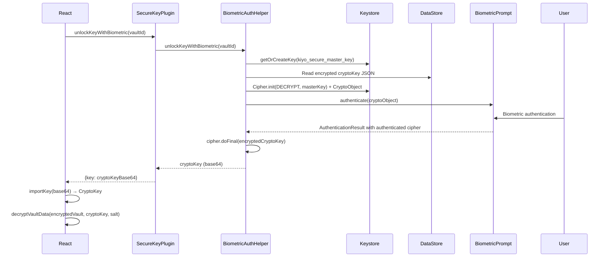

# KIYO — Hermes Project Context

## Project Overview
**KIYO** — Offline-first, privacy-focused Android password manager with system-level autofill integration.
- 로컬 암호화 저장 (PBKDF2 100,000회 + AES-GCM)
- Android AutofillService (API 26+)로 앱/웹 자동완성
- 네트워크 권한 없음, 클라우드 동기화 없음, 모든 데이터 로컬 저장
- 다중 암호화 볼트 생성/가져오기/백업/복원 지원
- **Android Keystore 연동** — 자동완성용 SQLite DB 마스터 키(`kiyo_master_key`)와 생체인증 볼트 언락 키(`kiyo_secure_master_key`)를 각각 별도 Keystore 마스터 키로 보호하여 평문 저장 방지
- **자동 잠금 (Auto-lock)** — `none` / `1m` / `10m` / `30m` 4단계 설정 (활동 감지 시 타이머 리셋, 암호화 키 상실 시 즉시 잠금)

## Tech Stack
| Layer | Technologies |
|-------|--------------|
| Frontend | React 19, TypeScript, Vite, Tailwind CSS 4, Zustand, React Router 7 |
| Native Bridge | Capacitor 8 (Android) |
| Local DB | Dexie.js (IndexedDB) |
| Crypto | Web Crypto API (PBKDF2 + AES-GCM) |
| Android Native | Kotlin, AutofillService (API 26+), SQLiteOpenHelper, Android Keystore, DataStore (Preferences) |
| Testing | Vitest (unit/integration) |

## Architecture
```
┌─────────────┐     Capacitor Bridge      ┌──────────────────┐
│  React App  │ ◄──────────────────────► │  Android Native  │
│  (WebView)  │   Plugin: KiyoAutofill   │  AutofillService │
└──────┬──────┘                           └────────┬─────────┘
       │                                           │
       ▼                                           ▼
┌─────────────┐                           ┌──────────────────┐
│  IndexedDB  │                           │ SQLCipher DB     │
│  (Dexie)    │                           │ (Autofill Repo)  │
│  - 계정/설정 │                           │  - 자동완성용 계정 │
└─────────────┘                           └────────┬─────────┘
       │                                           │
       │ 파일 시스템 (Documents)                   │
       ▼                                           ▼
┌─────────────┐                           ┌────────▼────────┐
│  암호화 JSON │                           │  DB_KEY (AES-256)│
│  (PBKDF2+AES)│                           │  SQLCipher 암호화 │
└─────────────┘                           └────────┬────────┘
                                                   │
                                                   ▼
┌─────────────────────────────────────────────────────────────────┐
│                      Android Keystore                            │
│  ┌────────────────────┐         ┌────────────────────┐          │
│  │ kiyo_master_key    │         │ kiyo_secure_master_│          │
│  │ (AES-256-GCM, TEE) │         │ key (AES-256-GCM)  │          │
│  └─────────┬──────────┘         └─────────┬──────────┘          │
│            │                              │                     │
│            ▼                              ▼                     │
│  ┌─────────────────────────┐    ┌─────────────────────────┐    │
│  │   DatabaseKeyManager    │    │   SecureKeyManager      │    │
│  │  - DB_KEY: 32-byte      │    │  - Wraps React cryptoKey│    │
│  │  - Encrypt w/ master    │    │  - BiometricAuthHelper  │    │
│  │  - Store in DataStore   │    │  - Store in SharedPrefs │    │
│  └───────────┬─────────────┘    └───────────┬─────────────┘    │
└─────────────┼───────────────────────────────┼───────────────────┘
              │                               │
              ▼                               ▼
     ┌─────────────────────┐         ┌─────────────────────┐
     │ kiyo_security_prefs │         │ kiyo_secure_prefs   │
     │ DataStore           │         │ SharedPreferences   │
     │ - db_encrypted_key  │         │ - encrypted_key     │
     └─────────────────────┘         └─────────────────────┘
              │                               │
              ▼                               ▼
     ┌─────────────────────┐         ┌─────────────────────┐
     │   AutofillService   │         │   SecureKeyPlugin   │
     │   (Keystore 인증)    │         │   (Biometric 언락)   │
     └─────────────────────┘         └─────────────────────┘
```

- **React App**: UI, 계정 관리, 설정, 암호화/복호화 수행
- **Capacitor Plugin**: React ↔ Native 통신 브리지 (세션 키 전달, 계정 동기화, 자동완성 상태 확인, 생체인증 키 저장/언락)
- **AutofillService**: Android 시스템 자동완성 제공 (필드 탐지, 계정 매칭, FillResponse 구성, Keystore를 통한 인증)
- **KeystoreManager**: Android Keystore 마스터 키(`kiyo_master_key`) 생성/관리, DB_KEY 암호화/복호화
- **DatabaseKeyManager**: `kiyo_security_prefs` DataStore에서 암호화된 DB_KEY 읽기/쓰기, Keystore로 래핑/언래핑
- **SecureKeyManager**: Android Keystore 마스터 키(`kiyo_secure_master_key`) 생성/관리, React cryptoKey 암호화/복호화
- **BiometricAuthHelper**: CryptoObject 패턴으로 생체인증 프롬프트 처리, 실제 암/복호화 수행
- **SecureKeyPlugin**: Capacitor 플러그인 (React ↔ Native 생체인증 키 저장/언락 브리지)
- **SQLCipher DB**: `AutofillRepository`가 사용하는 암호화된 SQLite DB (DB_KEY로 암호화)

## Commands (from project root)

```bash
# Development
npm run dev                    # Vite dev server (host 0.0.0.0)
npm run build                  # TypeScript build + Vite build
npm run typecheck              # tsc -b --noEmit
npm run lint                   # ESLint
npm run preview                # Vite preview

# Testing
npm run test                   # vitest run --typecheck
npm run test:ui                # vitest --ui
npm run check                  # typecheck + test

# Android
npm run android:run            # npx cap run android
npm run android:build          # build + cap sync + gradle assembleDebug

# Capacitor
npx cap sync android           # Sync web assets to Android
npx cap open android           # Open Android Studio
```

## Project Structure
```
KIYO/
├── .hermes.md                 # THIS FILE
├── package.json
├── tsconfig.json              # Project references
├── tsconfig.app.json          # App TypeScript config
├── tsconfig.node.json         # Node/Config TypeScript config
├── vite.config.ts             # Vite + Vitest config
├── tailwind.config.js         # Tailwind CSS 4 config
├── index.html
├── android/                   # Capacitor Android project
│   ├── build.gradle
│   ├── variables.gradle
│   ├── app/
│   │   ├── build.gradle
│   │   └── src/main/
│   │       ├── AndroidManifest.xml
│   │       ├── java/com/kiyo/app/
│   │       │   ├── KiyoApplication.kt
│   │       │   ├── MainActivity.java
│   │       │   ├── autofill/          # KiyoAutofillService + Repository
│   │       │   │   ├── service/       # KiyoAutofillService, AuthRequestHandler
│   │       │   │   ├── repository/    # AutofillRepository, DomainMatcher, AccountMapper
│   │       │   │   ├── detection/     # FieldDetector, FieldScorer, FieldScoringRules, FieldCandidate
│   │       │   │   ├── response/      # FillResponseBuilder
│   │       │   │   ├── viewnode/      # ViewNodeTraversal, ViewNodeExtractor, ViewNodePredicate, HtmlAttributeExtractor
│   │       │   │   ├── credential/    # CredentialExtractor
│   │       │   │   ├── icon/          # IconResourceMapper
│   │       │   │   ├── biometric/     # KiyoBiometricActivity
│   │       │   │   ├── settings/      # AutofillSettingsActivity
│   │       │   ├── capacitor/         # KiyoAutofillPlugin
│   │       │   └── security/          # KeystoreManager, DatabaseKeyManager
│   │       └── res/
│   └── capacitor-cordova-android-plugins/
├── src/
│   ├── main.tsx                  # Entry point
│   ├── App.tsx                   # Root component + routing
│   ├── index.css                 # Tailwind imports
│   ├── pages/                    # Route pages
│   │   ├── Auth.tsx              # PIN/생체인증 진입
│   │   ├── Home.tsx              # 계정 리스트
│   │   ├── AccountList.tsx
│   │   ├── AccountDetail.tsx
│   │   ├── AccountEdit.tsx
│   │   ├── Settings.tsx
│   │   ├── Alerts.tsx
│   │   ├── AutofillTestLogin.tsx
│   │   └── TemplateList.tsx
│   │   └── TemplateEdit.tsx
│   ├── components/               # Reusable UI
│   │   ├── BaseDialog.tsx
│   │   ├── BottomTabs.tsx
│   │   ├── Button.tsx
│   │   ├── PasswordGenerator.tsx
│   │   ├── PinChangeDialog.tsx
│   │   ├── WebsiteSelector.tsx
│   │   ├── FileCreateDialog.tsx
│   │   ├── FileOpenDialog.tsx
│   │   ├── AutoLockIndicator.tsx
│   │   ├── AutoLockProvider.tsx
│   │   ├── AutofillSettings.tsx
│   │   ├── FieldTypeSelector.tsx
│   │   ├── IconPicker.tsx
│   │   ├── PasswordField.tsx
│   │   ├── TemplateFieldEditor.tsx
│   │   └── TemplatePicker.tsx
│   ├── hooks/                    # Custom React hooks
│   │   ├── useAutofill.ts        # Capacitor autofill bridge
│   │   ├── useKiyoAutofill.ts
│   │   ├── useSecureClipboard.ts
│   │   └── useAutoLock.ts
│   ├── store/                    # Zustand stores
│   │   ├── accountStore.ts       # 계정 CRUD, 암호화
│   │   ├── sessionStore.ts       # SecuritySession 관리
│   │   ├── settingsStore.ts
│   │   └── templateStore.ts
│   ├── crypto/                   # 암호화 유틸
│   │   ├── encryption.ts         # PBKDF2 + AES-GCM
│   │   ├── recordEncryption.ts   # 레코드 단위 암호화
│   │   └── crypto.utils.ts
│   ├── database/                 # Dexie + 파일 저장소
│   │   ├── db.ts                 # Dexie 스키마
│   │   ├── fileStorage.ts        # 암호화된 파일 I/O (pipeline functions)
│   │   ├── fileExport.ts         # 파일 export 유틸
│   │   ├── fileTable.ts          # 파일 레코드 테이블
│   │   ├── accountTable.ts       # 계정 테이블
│   │   └── templateTable.ts      # 템플릿 테이블
│   ├── models/                   # 타입 정의
│   │   ├── account.ts
│   │   ├── fieldTypes.ts
│   │   ├── template.ts
│   │   ├── vault.ts
│   │   └── websitePreset.ts
│   ├── plugins/                  # Capacitor 플러그인 래퍼
│   │   ├── kiyautofill.ts
│   │   └── kiyautofill.web.ts
│   ├── data/                     # 정적 데이터
│   │   ├── builtinTemplates.ts
│   │   ├── devAccounts.ts
│   │   └── websitePresets.ts
│   ├── errors/                   # 커스텀 에러
│   │   └── FileStorageError.ts
│   ├── utils/
│   └── test/                     # Vitest 설정/모킹
│       ├── common.setup.ts
│       ├── integration.setup.ts
│       ├── unit.setup.ts
│       ├── mocks/
│       ├── fixtures/
│       └── helpers/
└── docs/research/                # 아키텍처 문서
```
로그 파일 같은 일시적으로 사용하는 파일은 "KIYO\.agent" 여기에 저장한다.
계획 문서는 "KIYO\.hermes\plans"여기에 저장한다.


## Key Conventions for Hermes

### Code Style
- **TypeScript strict mode** — `noUnusedLocals`, `noUnusedParameters`, `verbatimModuleSyntax`
- **ESM only** — `type: "module"` in package.json, all imports use `.js` extension
- **Path aliases** — `@/` maps to `src/` (configured in tsconfig.app.json)
- **React 19** — Use new JSX transform, no `React` import needed

### Crypto Rules
- **NEVER persist encryption keys to disk** — keys live only in `SecuritySession` (memory)
- PIN → PBKDF2 (100k iterations) → AES-GCM key derivation
- Each vault file has its own salt + encrypted master key
- **레코드 단위 암호화** — 각 Account/Template 객체를 통째로 직렬화하여 단일 AES-GCM 블롭으로 암호화 (필드별 암호화 미사용)

- **Android/Capacitor Bridge**
- **Web → Native**: `KiyoAutofillPlugin` (Capacitor plugin) → `KiyoAutofillService` (AutofillService)
- **Native → Web**: `CapacitorWebView` evaluateJavascript for autofill responses
- Plugin methods: `initialize`, `setAutofillEnabled`, `getAvailableAutofillData`, `onAutofillRequest`

### Data Storage & Security

| 데이터 | 저장소 | 암호화 | 비고 |
|--------|--------|--------|------|
| 메인 계정 데이터 | 파일 시스템 (Documents) | AES-GCM (PIN 기반) | 사용자 파일로 백업/이동 가능 |
| 자동완성용 계정 | SQLite Database (Native) | SQLCipher + Keystore | AutofillService 전용, Keystore로 DB_KEY 보호 |
| IndexedDB 계정 | IndexedDB (Dexie) | AES-GCM 레코드 단위 | 전체 Account/Template 객체 암호화 |
| 앱 설정 | IndexedDB (Dexie) | 평문 | 테마, 폰트 등 비민감 설정 |
| `kiyo_master_key` | Android Keystore | 하드웨어/TEE 보호 | Autofill DB_KEY 래핑, 앱 삭제 시 소멸 |
| `kiyo_secure_master_key` | Android Keystore | 하드웨어/TEE 보호 | Biometric vault cryptoKey 래핑, 앱 삭제 시 소멸 |

### 자동완성 인증 캐싱 (Keystore, 30분 만료)

자동완성 서비스는 PIN 인증 후 Android Keystore를 통해 사용자 인증을 캐시합니다 (프로세스 재시작 후에도 유지, 30분 후 만료):

| 키 | 타입 | 설명 |
|-----|------|-------------|
| `db_encrypted_key` | 암호화된 키 | Keystore로 보호된 SQLCipher DB_KEY (iv + ciphertext) |

**채우기 요청 처리 로직** (`KiyoAutofillService.onFillRequest`):

1. Keystore를 통한 DB_KEY 접근 시도 (인증이 필요하면 `UserNotAuthenticatedException` 발생)
2. 예외 발생 시 → `FillResponseBuilder.createAuthResponse()`로 인증 요청 반환
3. 성공 시 → 계정 조회 및 채우기 응답 반환

> **Note**: `isEncrypted` 플래그를 React에서 동기화하던 방식은 제거되었습니다. 자동완성 서비스는 순수하게 Keystore 기반 인증에만 의존하며, 별도의 토큰 발급/갱신 로직은 없습니다.

---

### 생체인증 볼트 언락 (Biometric Vault Unlock)

React 볼트(`cryptoKey`)를 생체인증(지문/얼굴)으로 잠금 해제할 수 있습니다. 별도의 Keystore 마스터 키(`kiyo_secure_master_key`)를 사용합니다.

#### 구성 요소

| 구성 요소 | 역할 |
|-----------|------|
| `kiyo_secure_master_key` | Android Keystore 마스터 키 (AES-256-GCM, 생체인증 STRONG만 허용, 30분 인증 유효) |
| `SecureKeyManager` | `kiyo_secure_master_key` 생성/관리, 키 래핑/언래핑 |
| `BiometricAuthHelper` | CryptoObject 패턴으로 생체인증 프롬프트 표시, 실제 암/복호화 수행 |
| `SecureKeyPlugin` | Capacitor 플러그인 (React ↔ Native 브리지) |

#### 언락 플로우 (`unlockKeyWithBiometric`)



#### 저장 플로우 (`storeKey`)

1. React가 `cryptoKey`(base64)를 `SecureKeyPlugin.storeKey(vaultId, key)`로 전달
2. `BiometricAuthHelper.storeKey()`:
   - `Cipher.init(ENCRYPT_MODE, masterKey)` → `CryptoObject`
   - `BiometricPrompt.authenticate(promptInfo, cryptoObject)`로 생체인증 요청
   - 인증 성공 시 `authenticatedCipher.doFinal(plainKeyBytes)`로 실제 암호화
   - IV + ciphertext를 `kiyo_secure_prefs` SharedPreferences에 저장

#### 보안 속성

- **별도 마스터 키**: `kiyo_master_key`(autofill)와 `kiyo_secure_master_key`(biometric vault) 완전 분리
- **생체인증만 허용**: `AUTH_BIOMETRIC_STRONG` (장치 자격증명 미사용)
- **등록 변경 시 무효화**: `setInvalidatedByBiometricEnrollment(true)`
- **30분 인증 캐시**: `setUserAuthenticationParameters(30 * 60, ...)`
- **키 분리 저장**: autofill용 `kiyo_security_prefs`(DataStore) vs biometric용 `kiyo_secure_prefs`(SharedPreferences)

---

### File Storage Pipeline (New Architecture)

`fileStorage.ts`는 **pipeline functions**로 리팩터링되어 단계별로 책임이 분리됩니다:

| 단계 | 함수 | 설명 |
|------|------|------|
| 1 | `createEncryptedVault(vaultData, pin)` | PIN으로부터 CryptoKey 생성 + 볼트 데이터 암호화 |
| 1.5 | `decryptVaultData(encryptedData, pin, salt)` | PIN + salt로 CryptoKey 생성 + 암호화된 볼트 복호화 |
| 2 | `persistVaultRecord(fileName, vaultData)` | 볼트 데이터를 FileRecord로 변환해 DB에 저장 |
| 3 | `setupVaultSession({fileName, cryptoKey, salt})` | 세션 스토어에 볼트 정보 저장 (cryptoKey, salt, fileName) |
| 4 | `exportDataFile(data, fileName)` | 볼트 데이터를 파일 시스템에 export |

> **Note**: `syncAutofillToken()`은 **deprecated/no-op**입니다. Autofill 서비스는 React 측 토큰 상태를 사용하지 않고 순수하게 Android Keystore 기반 인증에 의존합니다.

### Testing
- `npm run test` runs **typecheck + vitest** — both must pass
- Test files: `*.test.ts` / `*.test.tsx` co-located with source
- Mocks in `src/test/mocks/`, fixtures in `src/test/fixtures/`
- Integration tests use real Dexie + crypto (no mocks)

### Git Workflow
- **Main branch**: `v2` (not `main`)
- Commit messages: conventional commits (feat, fix, chore, etc.)
- PR required for main branch, CI runs `npm run check`

## Important Files to Reference

| File | Purpose |
|------|---------|
| `src/crypto/encryption.ts` | Core crypto: deriveKey, encrypt, decrypt |
| `src/crypto/recordEncryption.ts` | 레코드 단위 암호화 (Account/Template 직렬화) |
| `src/database/fileStorage.ts` | Encrypted vault file I/O (pipeline functions) |
| `src/database/fileTable.ts` | 파일 레코드 테이블 CRUD |
| `src/database/accountTable.ts` | 계정 테이블 CRUD (암호화 포함) |
| `src/database/templateTable.ts` | 템플릿 테이블 CRUD (암호화 포함) |
| `src/store/sessionStore.ts` | In-memory SecuritySession (localStorage persist for fileName/salt) |
| `src/store/accountStore.ts` | Account CRUD with encryption |
| `src/store/templateStore.ts` | Template CRUD with encryption |
| `src/store/settingsStore.ts` | 설정 관리 (테마, 폰트, 자동잠금) |
| `android/app/src/main/java/com/kiyo/app/autofill/service/KiyoAutofillService.kt` | AutofillService 구현 |
| `android/app/src/main/java/com/kiyo/app/autofill/service/AuthRequestHandler.kt` | 인증 요청 처리 |
| `android/app/src/main/java/com/kiyo/app/autofill/repository/AutofillRepository.kt` | 자동완성용 계정 리포지토리 |
| `android/app/src/main/java/com/kiyo/app/autofill/repository/DomainMatcher.kt` | 도메인 매칭 로직 |
| `android/app/src/main/java/com/kiyo/app/autofill/repository/AccountMapper.kt` | React JSON → AutofillAccount 파싱 |
| `android/app/src/main/java/com/kiyo/app/security/KeystoreManager.kt` | Android Keystore 마스터 키 관리 (`kiyo_master_key`) |
| `android/app/src/main/java/com/kiyo/app/security/DatabaseKeyManager.kt` | DB_KEY 래핑/언래핑 (DataStore 연동) |
| `android/app/src/main/java/com/kiyo/app/securekey/SecureKeyManager.kt` | Android Keystore 마스터 키 관리 (`kiyo_secure_master_key`) |
| `android/app/src/main/java/com/kiyo/app/securekey/BiometricAuthHelper.kt` | CryptoObject 패턴 생체인증 처리 |
| `android/app/src/main/java/com/kiyo/app/securekey/SecureKeyPlugin.kt` | Capacitor 플러그인 (생체인증 키 저장/언락) |
| `android/app/src/main/java/com/kiyo/app/capacitor/KiyoAutofillPlugin.kt` | Capacitor 플러그인 브리지 |
| `src/plugins/kiyautofill.ts` | Capacitor plugin TypeScript wrapper |
| `src/plugins/kiyosecurekey.ts` | SecureKey Capacitor plugin TypeScript wrapper |
| `src/hooks/useAutofill.ts` | React hook for autofill |
| `src/hooks/useAutoLock.ts` | 자동 잠금 타이머 훅 |
| `src/components/AutoLockProvider.tsx` | 자동 잠금 프로바이더 |
| `src/components/AutofillSettings.tsx` | 자동완성 설정 UI |

## Hermes-Specific Notes

### When working in this repo:
1. **Run `npm run check` before committing** — catches type errors + failing tests
2. **Android changes need `npx cap sync android`** after web build
3. **Crypto changes require integration tests** — see `fileStorage.encryption.integration.test.ts`
4. **Autofill testing** — use `AutofillTestLogin` page or real Android device
5. **Pipeline functions 사용** — `fileStorage.ts`의 `createEncryptedVault`, `persistVaultRecord`, `setupVaultSession`, `syncAutofillToken`, `exportVaultFile` 사용 (기존 `saveDataFile` deprecated)
6. **SecuritySession 키는 메모리만** — `sessionStore.ts`는 cryptoKey를 메모리에만 보관, localStorage에는 fileName/salt만 persist

### Don't do:
- ❌ Store encryption keys in IndexedDB/localStorage
- ❌ Skip `typecheck` — TS errors block CI
- ❌ Modify `android/` without running `cap sync`
- ❌ Commit `node_modules/`, `dist/`, `android/app/build/`
- ❌ 필드별 암호화 사용 — 레코드 단위 암호화(`recordEncryption.ts`)가 표준

### Environment
- Node ≥ 20, pnpm/npm
- Android SDK 34+, JDK 17
- Capacitor CLI: `npx cap`

---
<!-- OPENWIKI:START -->

## OpenWiki

See [AGENTS.md](AGENTS.md) for OpenWiki agent instructions.

<!-- OPENWIKI:END -->
