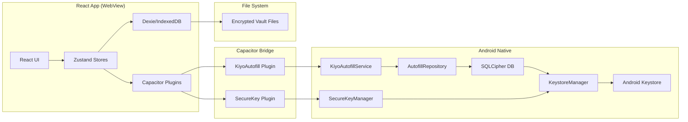

# KIYO

**Offline-first, privacy-focused Android password manager with system-level autofill integration.**

KIYO는 사용자의 비밀번호를 로컬에만 저장하며, Android AutofillService를 통해 앱과 웹에서 시스템 레벨 자동완성을 제공합니다.

## Features

- **로컬 암호화 저장** - PBKDF2(100,000회) + AES-GCM으로 PIN 기반 데이터 암호화
- **Android Autofill 연동** - 시스템 자동완성 서비스(API 26+)로 앱/웹 로그인 폼 자동 채우기
- **오프라인 퍼스트** - 네트워크 권한 없음, 클라우드 동기화 없음, 모든 데이터 로컬 저장
- **다중 데이터 파일** - 여러 암호화된 볼트 생성/가져오기/백업/복원 지원
- **도메인/패키지 매칭** - 웹사이트 도메인과 앱 패키지명으로 계정 자동 매칭
- **비밀번호 생성기** - 길이, 문자 종류 커스터마이징 가능한 안전한 비밀번호 생성
- **즐겨찾기·태그·템플릿** - 계정 분류와 자주 쓰는 필드 템플릿 관리
- **안전한 세션 관리** - 암호화 키를 디스크에 저장하지 않고 메모리에만 보관
- **Android Keystore 연동** - 자동완성용 SQLite DB 마스터 키(`kiyo_master_key`)와 생체인증 볼트 언락 키(`kiyo_secure_master_key`)를 각각 별도 Keystore 마스터 키로 보호하여 평문 저장 방지
- **자동완성 인증 캐싱** - Android Keystore를 통한 사용자 인증 캐싱 (30분, 프로세스 재시작 후 유지)
- **자동 잠금 (Auto-lock)** - `none` / `1m` / `10m` / `30m` 4단계 설정 (활동 감지 시 타이머 리셋, 암호화 키 상실 시 즉시 잠금)
- **생체인증 로그인 (Biometric Unlock)** - 지문/얼굴 인증으로 볼트 잠금 해제 (CryptoObject 패턴, 별도 Keystore 키 사용)

## Tech Stack

| Layer              | Technologies                                                    |
| ------------------ | --------------------------------------------------------------- |
| **Frontend**       | React 19, TypeScript, Vite, Tailwind CSS, Zustand, React Router |
| **Native Bridge**  | Capacitor 8 (Android)                                           |
| **Local DB**       | Dexie.js (IndexedDB)                                            |
| **Crypto**         | Web Crypto API (PBKDF2 + AES-GCM)                               |
| **Android Native** | Kotlin, AutofillService (API 26+), SQLiteOpenHelper, Android Keystore, DataStore (Preferences) |
| **Testing**        | Vitest (unit/integration)                                       |

## Architecture



```
┌─────────────┐     Capacitor Bridge      ┌──────────────────┐
│  React App  │ ◄──────────────────────► │  Android Native  │
│  (WebView)  │   Plugin: KiyoAutofill   │  AutofillService │
└──────┬──────┘                           └────────┬─────────┘
       │                                           │
       ▼                                           ▼
┌─────────────┐                           ┌──────────────────┐
│  IndexedDB  │                           │ SQLCipher DB     │
│  (Dexie)    │                           │ (Autofill Repo)  │
│  - 계정/설정 │                           │  - 자동완성용 계정 │
└─────────────┘                           └────────┬─────────┘
       │                                           │
       │ 파일 시스템 (Documents)                   │
       ▼                                           ▼
┌─────────────┐                           ┌────────▼────────┐
│  암호화 JSON │                           │  DB_KEY (AES-256)│
│  (PBKDF2+AES)│                           │  SQLCipher 암호화 │
└─────────────┘                           └────────┬────────┘
                                                   │
                                                   ▼
┌─────────────────────────────────────────────────────────────────┐
│                      Android Keystore                            │
│  ┌────────────────────┐         ┌────────────────────┐          │
│  │ kiyo_master_key    │         │ kiyo_secure_master_│          │
│  │ (AES-256-GCM, TEE) │         │ key (AES-256-GCM)  │          │
│  └─────────┬──────────┘         └─────────┬──────────┘          │
│            │                              │                     │
│            ▼                              ▼                     │
│  ┌─────────────────────────┐    ┌─────────────────────────┐    │
│  │   DatabaseKeyManager    │    │   SecureKeyManager      │    │
│  │  - DB_KEY: 32-byte      │    │  - Wraps React cryptoKey│    │
│  │  - Encrypt w/ master    │    │  - BiometricAuthHelper  │    │
│  │  - Store in DataStore   │    │  - Store in SharedPrefs │    │
│  └───────────┬─────────────┘    └───────────┬─────────────┘    │
└─────────────┼───────────────────────────────┼───────────────────┘
              │                               │
              ▼                               ▼
     ┌─────────────────────┐         ┌─────────────────────┐
     │ kiyo_security_prefs │         │ kiyo_secure_prefs   │
     │ DataStore           │         │ SharedPreferences   │
     │ - db_encrypted_key  │         │ - encrypted_key     │
     └─────────────────────┘         └─────────────────────┘
              │                               │
              ▼                               ▼
     ┌─────────────────────┐         ┌─────────────────────┐
     │   AutofillService   │         │   SecureKeyPlugin   │
     │   (Keystore 인증)    │         │   (Biometric 언락)   │
     └─────────────────────┘         └─────────────────────┘
```

- **React App**: UI, 계정 관리, 설정, 암호화/복호화 수행
- **Capacitor Plugin**: React ↔ Native 통신 브리지 (세션 키 전달, 계정 동기화, 자동완성 상태 확인, 생체인증 키 저장/언락)
- **AutofillService**: Android 시스템 자동완성 제공 (필드 탐지, 계정 매칭, FillResponse 구성, Keystore를 통한 인증)
- **KeystoreManager**: Android Keystore 마스터 키(`kiyo_master_key`) 생성/관리, DB_KEY 암호화/복호화
- **DatabaseKeyManager**: `kiyo_security_prefs` DataStore에서 암호화된 DB_KEY 읽기/쓰기, Keystore로 래핑/언래핑
- **SecureKeyManager**: Android Keystore 마스터 키(`kiyo_secure_master_key`) 생성/관리, React cryptoKey 암호화/복호화
- **BiometricAuthHelper**: CryptoObject 패턴으로 생체인증 프롬프트 처리, 실제 암/복호화 수행
- **SecureKeyPlugin**: Capacitor 플러그인 (React ↔ Native 생체인증 키 저장/언락 브리지)
- **SQLCipher DB**: `AutofillRepository`가 사용하는 암호화된 SQLite DB (DB_KEY로 암호화)
- **AutofillRepository**: 자동완성용 계정 리포지토리
- **DomainMatcher**: 도메인 매칭 로직 (정확/서브도메인)
- **AccountMapper**: React JSON → AutofillAccount 파싱

## Security

### 암호화 방식 (React Vault)

- **키 파생**: PBKDF2-HMAC-SHA256, 100,000회 반복, 16바이트 랜덤 솔트
- **데이터 암호화**: AES-GCM 256비트, 12바이트 IV, 인증 태그 내장
- **레코드 단위 암호화**: 각 Account/Template 객체를 통째로 직렬화하여 단일 AES-GCM 블롭으로 암호화 (필드별 암호화 미사용)
- **파일 포맷**: 버전, 솔트, IV, 암호문을 Base64로 인코딩하여 JSON 저장

### 키 관리

- **PIN 검증**: 저장된 솔트로 키 파생 → 복호화 시도 → 성공 시 세션에 키 보관 (메모리만)
- **Autofill 인증**: Android Keystore를 통한 사용자 인증 캐싱 (30분 만료, 프로세스 재시작 후 유지)
- **Biometric 언락**: 별도 마스터 키(`kiyo_secure_master_key`)로 React `cryptoKey`를 Keystore에 래핑, CryptoObject 패턴으로 생체인증 시 복호화

### Android Keystore 연동

자동완성 서비스용 SQLite 데이터베이스(SQLCipher)의 마스터 키(DB_KEY)와 생체인증 볼트 언락용 React `cryptoKey`는 각각 별도의 Android Keystore 마스터 키로 보호됩니다.

#### 1. `kiyo_master_key` — Autofill DB 보호

- **용도**: SQLCipher DB_KEY 래핑 (자동완성 서비스용)
- **알고리즘**: AES-256-GCM
- **인증**: 생체인증 STRONG 또는 장치 자격증명 (PIN/패턴)
- **만료**: 30분 캐시
- **관리**: `KeystoreManager`, `DatabaseKeyManager`
- **저장소**: `kiyo_security_prefs` (DataStore)
- **플로우**: `DatabaseKeyManager.getKey()` 호출 시 DataStore에서 암호화된 키 읽기 → Keystore 마스터 키로 복호화 → 평문 DB_KEY 획득 (최초 호출 시 새 키 생성 후 암호화 저장)

#### 2. `kiyo_secure_master_key` — Biometric Vault Unlock

- **용도**: React 볼트 `cryptoKey` 래핑 (생체인증 로그인용)
- **알고리즘**: AES-256-GCM
- **인증**: 생체인증 STRONG만 (지문/얼굴, 장치 자격증명 미사용)
- **만료**: 30분 캐시
- **등록 변경 시 무효화**: `setInvalidatedByBiometricEnrollment(true)`
- **관리**: `SecureKeyManager`, `BiometricAuthHelper`, `SecureKeyPlugin`
- **저장소**: `kiyo_secure_prefs` (SharedPreferences)
- **플로우**: 
  - **저장**: `SecureKeyPlugin.storeKey(vaultId, cryptoKeyBase64)` → `BiometricAuthHelper.storeKey()` → CryptoObject(ENCRYPT) → 생체인증 프롬프트 → 인증 성공 시 실제 암호화 → SharedPreferences 저장
  - **언락**: `SecureKeyPlugin.unlockKeyWithBiometric(vaultId)` → `BiometricAuthHelper.unlockKeyWithBiometric()` → SharedPreferences에서 암호화된 키 읽기 → CryptoObject(DECRYPT, IV) → 생체인증 프롬프트 → 인증 성공 시 실제 복호화 → `cryptoKey`(base64) 반환 → React에서 `importKey` 후 볼트 복호화

### 데이터 저장소별 보안

| 데이터           | 저장소                   | 암호화             | 비고                            |
| ---------------- | ------------------------ | ------------------ | ------------------------------- |
| 메인 계정 데이터 | 파일 시스템 (Documents)  | AES-GCM (PIN 기반) | 사용자 파일로 백업/이동 가능    |
| 자동완성용 계정  | SQLite Database (Native) | SQLCipher + Keystore | AutofillService 전용, Keystore로 DB_KEY 보호 |
| IndexedDB 계정   | IndexedDB (Dexie)        | AES-GCM 레코드 단위 | 전체 Account/Template 객체 암호화 |
| 앱 설정          | IndexedDB (Dexie)        | 평문               | 테마, 폰트 등 비민감 설정       |
| `kiyo_master_key` | Android Keystore         | 하드웨어/TEE 보호  | Autofill DB_KEY 래핑, 앱 삭제 시 소멸 |
| `kiyo_secure_master_key` | Android Keystore         | 하드웨어/TEE 보호  | Biometric vault cryptoKey 래핑, 앱 삭제 시 소멸 |

### 자동완성 인증 캐싱 (Keystore, 30분 만료)

자동완성 서비스는 PIN 인증 후 Android Keystore를 통해 사용자 인증을 캐시합니다 (프로세스 재시작 후에도 유지, 30분 후 만료):

| 키 | 타입 | 설명 |
|-----|------|-------------|
| `db_encrypted_key` | 암호화된 키 | Keystore로 보호된 SQLCipher DB_KEY (iv + ciphertext) |

**채우기 요청 처리 로직** (`KiyoAutofillService.onFillRequest`):

1. Keystore를 통한 DB_KEY 접근 시도 (인증이 필요하면 `UserNotAuthenticatedException` 발생)
2. 예외 발생 시 → `FillResponseBuilder.createAuthResponse()`로 인증 요청 반환
3. 성공 시 → 계정 조회 및 채우기 응답 반환

> **Note**: `isEncrypted` 플래그를 React에서 동기화하던 방식은 제거되었습니다. 자동완성 서비스는 순수하게 Keystore 기반 인증에만 의존하며, 별도의 토큰 발급/갱신 로직은 없습니다.

### 생체인증 볼트 언락 (Biometric Vault Unlock)

React 볼트(`cryptoKey`)를 생체인증(지문/얼굴)으로 잠금 해제할 수 있습니다. 별도의 Keystore 마스터 키(`kiyo_secure_master_key`)를 사용합니다.

#### 구성 요소

| 구성 요소 | 역할 |
|-----------|------|
| `kiyo_secure_master_key` | Android Keystore 마스터 키 (AES-256-GCM, 생체인증 STRONG만 허용, 30분 인증 유효) |
| `SecureKeyManager` | `kiyo_secure_master_key` 생성/관리, 키 래핑/언래핑 |
| `BiometricAuthHelper` | CryptoObject 패턴으로 생체인증 프롬프트 표시, 실제 암/복호화 수행 |
| `SecureKeyPlugin` | Capacitor 플러그인 (React ↔ Native 브리지) |

#### 보안 속성

- **별도 마스터 키**: `kiyo_master_key`(autofill)와 `kiyo_secure_master_key`(biometric vault) 완전 분리
- **생체인증만 허용**: `AUTH_BIOMETRIC_STRONG` (장치 자격증명 미사용)
- **등록 변경 시 무효화**: `setInvalidatedByBiometricEnrollment(true)`
- **30분 인증 캐시**: `setUserAuthenticationParameters(30 * 60, ...)`
- **키 분리 저장**: autofill용 `kiyo_security_prefs`(DataStore) vs biometric용 `kiyo_secure_prefs`(SharedPreferences)

### 위협 모델 및 완화

| 위협 | 완화 |
|--------|-------------|
| 기기 분실/도난 | PIN 필요, 생체인증으로 autofill, 키는 Keystore(TEE)에 보관 |
| 악성 앱 | 네트워크 권한 없음, 감지된 로그인 폼만 자동완성 |
| 백업 추출 | 볼트 파일은 PBKDF2(100k)로 암호화, 파일별 솔트 |
| 메모리 덤프 | cryptoKey는 JS 메모리에만, 잠금 시 즉시 삭제; Keystore 키는 추출 불가 |
| 생체인증 스푸핑 | AUTH_BIOMETRIC_STRONG, 등록 변경 시 무효화 |
| SQLCipher 키 노출 | DB_KEY는 Keystore 마스터 키로 래핑, 평문 저장 안 함 |

## Installation

### Prerequisites

- Node.js 20+
- Android Studio (Android 빌드용)
- JDK 17+

### Development

```bash
# 의존성 설치
npm install

# 개발 서버 (웹 프리뷰)
npm run dev

# 타입 체크
npm run typecheck

# 린트
npm run lint

# 테스트
npm run test
```

### Android Build

```bash
# 웹 빌드 + Capacitor 동기화 + Android Studio 열기
npm run android:build

# 또는 직접 실행 (디버그 APK 빌드 후 설치)
npm run android:run
```

## Usage

1. **초기 설정**: 앱 실행 → "새 파일 만들기" → 파일명 입력 → PIN 설정 (4~6자리)
2. **계정 추가**: 하단 '+' 버튼 → 웹사이트/앱 선택 또는 직접 입력 → 필드 커스터마이징
3. **자동완성 활성화**: Android 설정 → 자동완성 서비스 → KIYO 선택 → 권한 허용
4. **사용**: 앱/웹 로그인 화면에서 필드 포커스 → KIYO 제안 표시 → PIN/생체인증으로 잠금 해제 → 자동 채우기
5. **백업/복원**: 설정 → 데이터 백업 (PIN 입력) → 암호화된 JSON 파일 저장/가져오기

## Development Status

### Implemented ✅

- React + Capacitor 하이브리드 앱 구조
- PBKDF2 + AES-GCM 암호화/복호화 (React Vault)
- 다중 데이터 파일 생성/열기/백업/가져오기
- PIN 기반 인증 및 세션 관리
- Android AutofillService (API 26+) - 필드 탐지, 도메인/패키지 매칭, FillResponse
- AuthRequestHandler - 인증 요청 처리 (토큰 검증, 인증 응답 생성)
- Capacitor 플러그인 브리지 (React ↔ Native)
- IndexedDB (Dexie) 로컬 데이터베이스
- 계정 CRUD, 즐겨찾기, 태그, 템플릿
- 비밀번호 생성기
- 테마/폰트/자동잠금 설정
- 단위/통합 테스트 (Vitest, Robolectric)
- 자동완성 필드 탐지/점수/매칭 단위 테스트
- AuthRequestHandler, DomainMatcher, AccountMapper, FieldScoringRules 단위 테스트
- KiyoAutofillPlugin 스모크 테스트
- 생체인증 볼트 언락 (SecureKeyManager, BiometricAuthHelper, SecureKeyPlugin)

### In Progress 🚧

- 자동완성 저장 UI (SaveInfo) 개선
- 웹뷰/브라우저 자동완성 지원 확대
- 데이터 내보내기/가져오기 포맷 표준화 (CSV, Bitwarden JSON)

### Planned 📋

- 다국어 지원 (영어, 일본어)
- 접근성 개선 (TalkBack)
- F-Droid 및 Google Play Store 배포 준비

## License

MIT License - see [LICENSE](LICENSE) for details.

## Contributing

1. Fork the repository
2. Create a feature branch (`git checkout -b feature/amazing-feature`)
3. Commit changes (`git commit -m 'Add amazing feature'`)
4. Push to branch (`git push origin feature/amazing-feature`)
5. Open a Pull Request

## Links

- [Capacitor Documentation](https://capacitorjs.com/docs)
- [Android AutofillService Guide](https://developer.android.com/guide/topics/text/autofill-services)
- [Web Crypto API](https://developer.mozilla.org/en-US/docs/Web/API/Web_Crypto_API)
- [Dexie.js Documentation](https://dexie.org/)