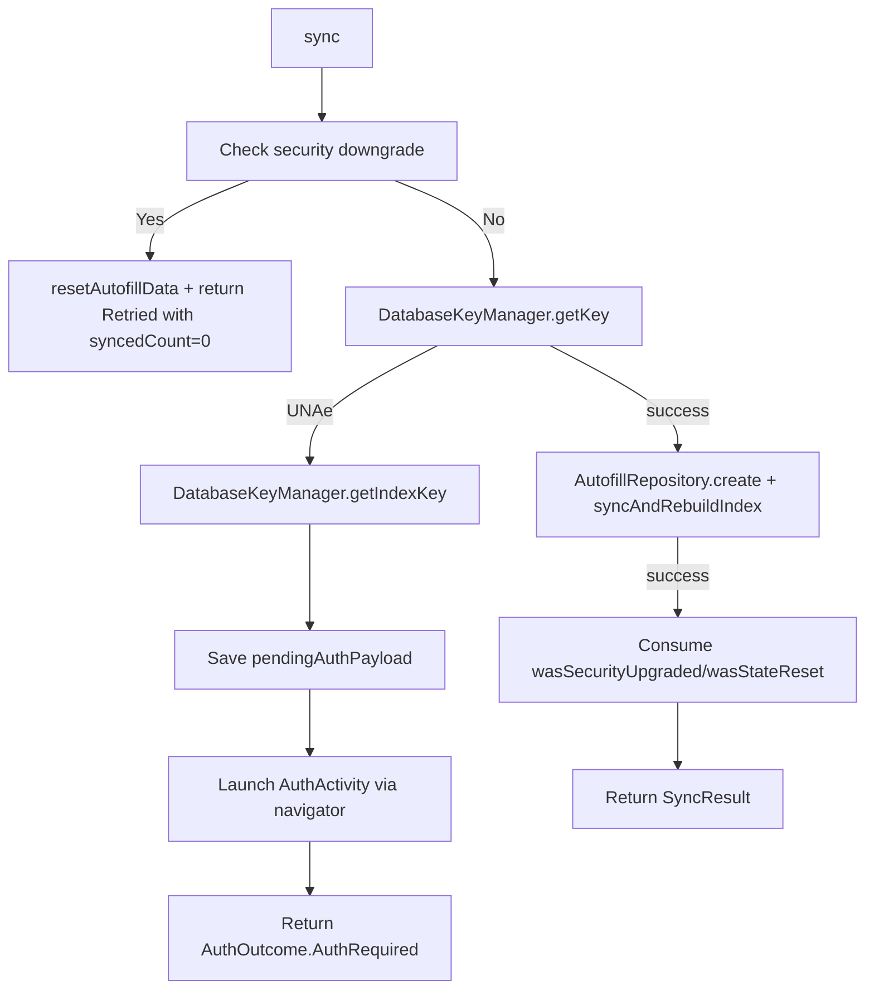

# AutofillSyncManager

`/android/app/src/main/java/com/kiyo/app/capacitor/AutofillSyncManager.kt` is the policy layer that decides how to handle the `syncAccountsFromReact` call, including the auth-retry flow when `DB_KEY` requires user authentication.

## SyncResult

```kotlin
data class SyncResult(
    val syncedCount: Int,
    val errorCount: Int,
    val success: Boolean,
    val securityUpgrade: Boolean = false
)
```

Returned to `KiyoAutofillPlugin` which serializes into the JS resolve payload.

## AuthOutcome Sealed Class

```kotlin
sealed class AuthOutcome {
    data class Retried(val result: SyncResult) : AuthOutcome()
    data class AuthRequired(val intentSender: IntentSender) : AuthOutcome()
}
```

The `sync` function returns one of:

- `AuthOutcome.Retried(result)` — sync completed (possibly after auth).
- `AuthOutcome.AuthRequired(intentSender)` — the caller must launch `intentSender` (the device-credential prompt) and retry.

## SyncAuthNavigator

```kotlin
fun interface SyncAuthNavigator {
    fun launchAuthActivity(intentSender: IntentSender)
}
```

Captured at `KiyoAutofillPlugin.load()` via:

```kotlin
activityResultNavigator = SyncAuthNavigator { sender ->
    startActivityForResult(IntentSenderRequest.Builder(sender).build(), AUTH_REQUEST_CODE)
}
```

This indirection lets the sync manager launch the auth activity without coupling to the Capacitor `Plugin.startActivityForResult` API (which is a `val` in the Plugin base class).

## sync

```kotlin
suspend fun sync(
    context: Context,
    accountsJson: String,
    navigator: SyncAuthNavigator,
    onSuccess: (SyncResult) -> Unit,
    onCancel: (String) -> Unit
)
```

The full sequence:



## handleAuthResult

```kotlin
suspend fun handleAuthResult(
    resultCode: Int,
    pendingPayload: String,
    onSuccess: (SyncResult) -> Unit,
    onCancel: (String) -> Unit
)
```

Called by `KiyoAutofillPlugin.handleOnActivityResult`. If `resultCode == RESULT_OK`, retries the sync with the same payload. If cancelled or any other code, invokes `onCancel`.

## ensureRepository / invalidateRepository

```kotlin
private var cachedRepository: AutofillRepository? = null

suspend fun ensureRepository(context: Context, dbKey: ByteArray, indexKey: ByteArray): AutofillRepository {
    val cached = cachedRepository
    if (cached != null) return cached
    val repo = AutofillRepository.create(context, dbKey, indexKey)
    cachedRepository = repo
    return repo
}

fun invalidateRepository() {
    cachedRepository?.close()
    cachedRepository = null
}
```

The repository is cached within a single `sync` invocation (to allow `syncAndRebuildIndex` to query the main DB and then write the index DB in the same transaction). On `wasStateReset()` the cache is invalidated, ensuring the next call constructs a fresh repository.

## Source Anchors

- `AutofillSyncManager.kt` — `/android/app/src/main/java/com/kiyo/app/capacitor/AutofillSyncManager.kt`
- Caller — `/android/app/src/main/java/com/kiyo/app/capacitor/KiyoAutofillPlugin.kt`
- Repository — `/android/app/src/main/java/com/kiyo/app/autofill/repository/AutofillRepository.kt`
- Key — `/android/app/src/main/java/com/kiyo/app/security/DatabaseKeyManager.kt`

## Tests

- `/android/app/src/test/java/com/kiyo/app/capacitor/AutofillSyncManagerTest.kt`