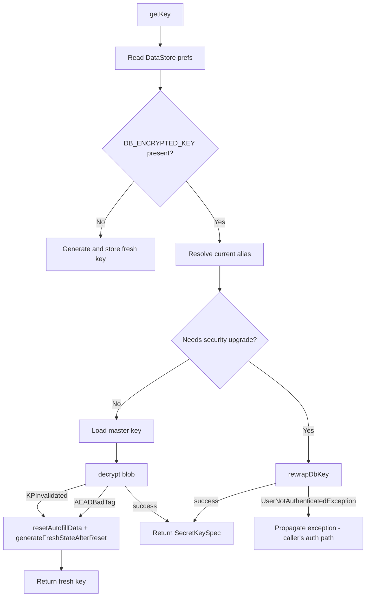

# DatabaseKeyManager

`/android/app/src/main/java/com/kiyo/app/security/DatabaseKeyManager.kt` is the central authority for the SQLCipher `DB_KEY` (and the non-auth `INDEX_KEY`) that protect the autofill databases.

## Design Principles

1. **Alias pointer** — DataStore preference `current_master_key_alias` points to the current `kiyo_master_key_N` alias. Re-wrap creates a new alias and switches the pointer.
2. **Atomic rewrap with rollback** — commit (new blob + new pointer) → delete old alias. Failure between steps leaves the old alias + old blob + old pointer intact.
3. **No caching** — every `getKey` call reads the current alias from DataStore and the current master key from Keystore. Caches would force stale-key failures after rewrap/reset.
4. **KPInvalidated = no salvage** — when the auth-required key is invalidated (biometric enrollment change, lock screen change), the wrapping is **not** recoverable; the autofill DB is reset and rebuilt on next sync.
5. **1-shot flags** — `wasSecurityUpgraded()` and `wasStateReset()` are consumed once per call; useful for UI notifications after rewrap or reset.

## Storage Backends

| Alias | Storage backend | Storage name |
|-------|-----------------|--------------|
| Autofill master (`kiyo_master_key_N`) | Jetpack DataStore (Preferences) | `kiyo_security_prefs` |
| Index master (`kiyo_index_key`) | (no external storage — derived on demand) | n/a |

The DataStore is a Kotlin extension:

```kotlin
private val Context.securityDataStore: DataStore<Preferences> by preferencesDataStore(
    name = "kiyo_security_prefs"
)
```

This is distinct from the SharedPreferences used by `BiometricAuthHelper` (`kiyo_secure_prefs`).

## Public API

```kotlin
suspend fun getKey(context: Context): SecretKey              // main auth-required DB_KEY
suspend fun getIndexKey(context: Context): SecretKey         // non-auth INDEX_KEY
fun wasSecurityUpgraded(): Boolean                            // 1-shot, reset on read
fun wasStateReset(): Boolean                                  // 1-shot, reset on read
```

## getKey Flow



## rewrapDbKey (Atomic Upgrade)

```kotlin
private suspend fun rewrapDbKey(context: Context, currentAlias: String, json: String): SecretKey {
    val oldMasterKey = KeystoreManager.getOrCreateKey(currentAlias)
    val plainBytes = KeystoreManager.decrypt(oldMasterKey, EncryptedKey.fromJson(json))
    val newAlias = nextAlias(currentAlias)
    val newMasterKey = KeystoreManager.createKey(newAlias)
    val reEncrypted = try {
        KeystoreManager.encrypt(newMasterKey, plainBytes)
    } catch (e: UserNotAuthenticatedException) {
        // New key's auth cache not primed → abort rewrap, leave old key intact
        throw e
    }
    context.securityDataStore.edit { preferences ->
        preferences[DB_ENCRYPTED_KEY] = EncryptedKey.toJson(reEncrypted)
        preferences[CURRENT_ALIAS] = newAlias
    }
    if (newAlias != currentAlias) {
        try { KeystoreManager.deleteKey(currentAlias) } catch (_: Exception) {}
    }
    return SecretKeySpec(plainBytes, "AES")
}
```

The DataStore `edit { ... }` block is atomic — either both `DB_ENCRYPTED_KEY` and `CURRENT_ALIAS` commit together, or neither does. The old alias is deleted **after** the commit so a crash between commit and delete is recoverable (next call resolves the old alias from the alias table, no data loss).

If the new auth-required key needs auth that hasn't been granted yet, `KeystoreManager.encrypt` throws `UserNotAuthenticatedException`. The rewrap aborts without touching DataStore — the old alias remains current.

## Reset Path (KPInvalidated / AEADBadTag)

```kotlin
fun resetAutofillData(context: Context) {
    context.deleteDatabase("kiyo_autofill.db")
    context.deleteDatabase("kiyo_autofill_index.db")
    // Reset alias pointer to fresh
}
```

```kotlin
suspend fun generateFreshStateAfterReset(context: Context): SecretKey {
    val newAlias = nextIndexAfterReset()
    val masterKey = KeystoreManager.createKey(newAlias)
    val plainBytes = DatabaseKeyGenerator.generateKey()  // 32 random bytes
    val encrypted = KeystoreManager.encrypt(masterKey, plainBytes)
    context.securityDataStore.edit { preferences ->
        preferences[DB_ENCRYPTED_KEY] = EncryptedKey.toJson(encrypted)
        preferences[CURRENT_ALIAS] = newAlias
    }
    securityUpgraded = false
    return SecretKeySpec(plainBytes, "AES")
}
```

`stateWasReset = true` is set so `AutofillSyncManager` knows to drop any cached repository after a reset.

## 1-Shot Flags

```kotlin
@Volatile private var securityUpgraded = false
@Volatile private var stateWasReset = false

fun wasSecurityUpgraded(): Boolean {
    val v = securityUpgraded
    securityUpgraded = false
    return v
}

fun wasStateReset(): Boolean {
    val v = stateWasReset
    stateWasReset = false
    return v
}
```

`AutofillSyncManager.sync` calls `wasSecurityUpgraded()` and `wasStateReset()` after `DatabaseKeyManager.getKey` to know whether to invalidate any cached repository and whether to surface a UI notification.

## Index Key

```kotlin
suspend fun getIndexKey(context: Context): SecretKey {
    KeystoreManager.init(context)
    return KeystoreManager.getOrCreateIndexKey()
}
```

A thin wrapper over `KeystoreManager.getOrCreateIndexKey()` (which always creates/loads `kiyo_index_key` with `requireAuth = false`). Not stored in DataStore — generated lazily.

## Source Anchors

- `DatabaseKeyManager.kt` — `/android/app/src/main/java/com/kiyo/app/security/DatabaseKeyManager.kt`
- Keystore — `/android/app/src/main/java/com/kiyo/app/security/KeystoreManager.kt`
- Generator — `/android/app/src/main/java/com/kiyo/app/security/DatabaseKeyGenerator.kt`
- Blob serialization — `/android/app/src/main/java/com/kiyo/app/security/EncryptedKey.kt`

## Tests

- `/android/app/src/test/java/com/kiyo/app/security/DatabaseKeyManagerTest.kt`