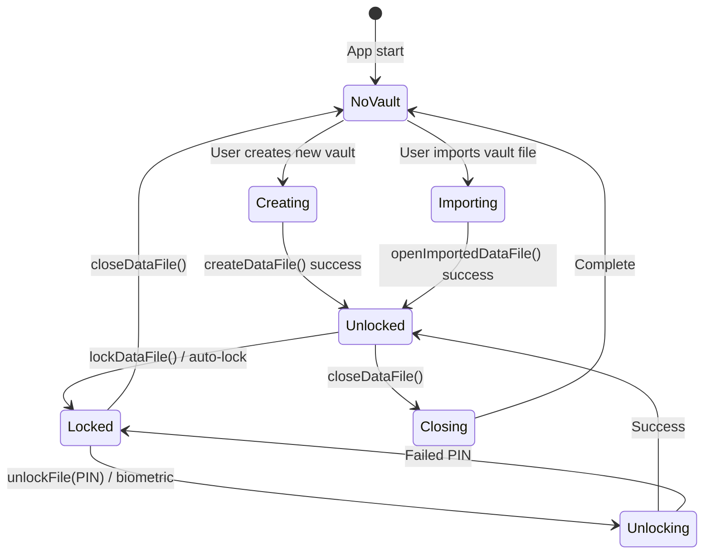
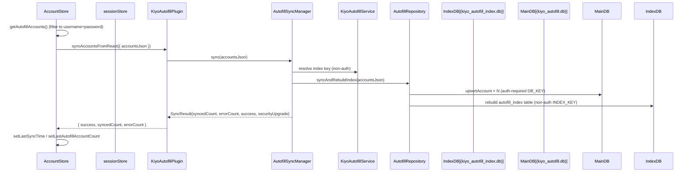
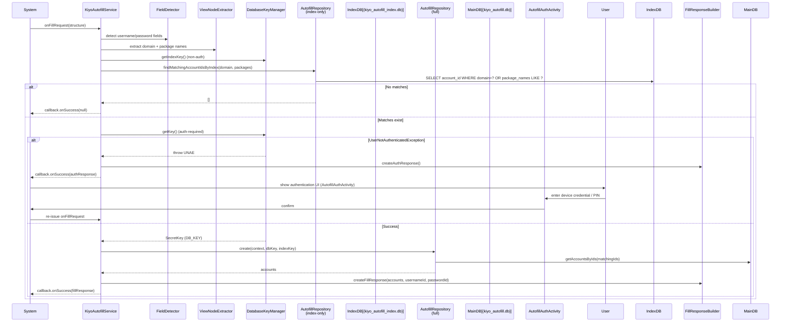

# Data Flow

KIYO has two architecturally distinct data flow paths between the React frontend and the Android native layer, plus a third fully client-side path for the vault file lifecycle.

## Vault Lifecycle (React-only path)



The vault is a logical abstraction stored in IndexedDB (`files` table) and optionally exported as a JSON file (Documents directory) or a SAF URI (backup). The lifecycle moves between NoVault, Unlocked, and Locked states.

## File Storage Pipeline (React)

```mermaid
flowchart TD
    subgraph "Create New Vault"
        A[createDataFile(fileName, pin?)] --> B{pin provided?}
        B -->|Yes| C[createCryptoKey(pin)]
        B -->|No| D[Plaintext vault]
        C --> E[encryptData(vault, key, salt)]
        E --> F[persistVaultRecord(fileName, encrypted)]
        D --> F
        F --> G[setupVaultSession(fileName, cryptoKey?, salt?)]
        G --> H[initializeStores: reset initialized flags + reload]
        H --> I[exportDataFile: write to Documents]
    end

    subgraph "Open Existing Vault"
        J[unlockFile(fileName, pin)] --> K[fileTable.getActiveFileInfo]
        K --> L{encrypted?}
        L -->|Yes| M[decryptVaultData(fileData, pin, salt)]
        L -->|No| N[Plaintext fileData]
        M --> O[setupVaultSession]
        N --> O
        O --> H
    end

    subgraph "Import Vault File"
        O2[openImportedDataFile(json, pin, fileName)] --> P{encrypted?}
        P -->|Yes| Q[verifyPin(data, pin)]
        P -->|No| R[parseFileData]
        Q --> S[decryptVaultData]
        S --> T[replaceDatabaseData: transactional rewrite]
        R --> T
        T --> U[setupVaultSession]
        U --> H
    end

    subgraph "Change PIN"
        V[changePin(fileName, oldPin, newPin)] --> W[decryptVaultData(old)]
        W --> X[createEncryptedVault(new)]
        X --> Y[persistVaultRecord]
    end

    subgraph "Lock / Close"
        L1[lockDataFile] --> L2[sessionStore.clearCryptoKey]
        C1[closeDataFile] --> C2[clear cryptoKey + metadata + autofill]
    end
```

`initializeStores` is the choke point that resets the store-side `initialized: false` flag on both `accountStore` and `templateStore` before reloading, so a vault swap does not leave stale accounts/templates from the prior vault.

## Vault CRUD → Auto-Save (React internal)

```mermaid
flowchart LR
    A[User Action: Add/Edit/Delete Account] --> B[accountStore.addAccount/updateAccount/deleteAccount]
    B --> C[accountTable.create/update/delete with cryptoKey]
    C --> D[Dexie: accounts table]
    D --> E[_persistAccounts]
    E --> F[enqueuePersistVaultSnapshot]
    F --> G[syncQueue: serialize, coalesce]
    G --> H[persistVaultSnapshot: file write]
    H --> I[syncToAutofill]
    I --> J{autofill enabled?}
    J -->|Yes| K[KiyoAutofill.syncAccountsFromReact]
    K --> L[AutofillSyncManager → KiyoAutofillPlugin]
    L --> M[AutofillRepository.syncAndRebuildIndex]
    M --> N[main + index DB writes]
```



`enqueuePersistVaultSnapshot` (in `src/database/syncQueue.ts`) coalesces multiple rapid mutations into a single file-write burst, executing on the latest session state at processing time (so the getter captures any changes between enqueue and process).

## React→Native Account Sync (one-shot, optional)

This is one of two paths between layers.



Conditions for sync:

- `Capacitor.getPlatform() === "android"` — sync is a no-op on web.
- `settingsStore.autofillEnabled === true`.
- `KiyoAutofill.isAutofillEnabled()` returns `{enabled: true, isOurService: true}`.
- React vault is unlocked (otherwise `getAutofillAccounts` may return stale or empty data).

When auth is required (`UserNotAuthenticatedException` for `DB_KEY`), `AutofillSyncManager.handleAuthResult` is invoked via `SyncAuthNavigator.launchAuthActivity`, and the sync is retried after the user completes `AutofillAuthActivity`.

## Native Autofill Request (per-FillRequest, in-process)

This is the second inter-layer path. It runs entirely on the Android side and never round-trips to React.



Key invariants:

- **Two-stage DB**: stage 1 uses `kiyo_autofill_index.db` (non-auth `INDEX_KEY`); stage 2 uses `kiyo_autofill.db` (auth-required `DB_KEY`). The auth gate is only reached when the index has matches — preventing spurious auth prompts for unknown apps.
- **Per-request fresh repository**: `KiyoAutofillService.onCreate` is intentionally empty. Every fill/save request constructs a fresh `AutofillRepository`, uses it, and closes it in `finally`. This avoids stale-key issues after `DatabaseKeyManager.rewrapDbKey` or KPInvalidated resets.
- **Self-package filter**: `com.kiyo.app` is excluded from package matching so the vault UI never autofills itself.

## Biometric Vault Unlock (React ↔ Native cross-layer)

```mermaid
sequenceDiagram
    participant React as Auth.tsx
    participant SecureKeyPlugin
    participant BiometricAuthHelper
    participant Keystore as kiyo_secure_master_key
    participant SharedPrefs as kiyo_secure_prefs
    participant sessionStore

    React->>SecureKeyPlugin: unlockKeyWithBiometric(vaultId)
    SecureKeyPlugin->>BiometricAuthHelper: unlockKeyWithBiometric(vaultId)
    BiometricAuthHelper->>Keystore: getOrCreateKey() (auth-required, biometric STRONG)
    BiometricAuthHelper->>SharedPrefs: read encrypted_key JSON
    BiometricAuthHelper->>BiometricPrompt: authenticate (non-CryptoObject)
    User->>BiometricPrompt: biometric (fingerprint/face)
    BiometricPrompt-->>BiometricAuthHelper: success
    BiometricAuthHelper->>BiometricAuthHelper: cipher.init(DECRYPT_MODE, masterKey, spec); doFinal()
    BiometricAuthHelper-->>SecureKeyPlugin: cryptoKey base64
    SecureKeyPlugin-->>React: { key: cryptoKeyBase64 } (or { keyCorrupted: true } on AEADBadTag)
    alt Success
        React->>sessionStore: setCryptoKeyFromBase64(keyBase64, salt)
        React->>fileStorage: initializeStores()
        React->>React: navigate("/accounts")
    else KeyCorrupted
        React->>React: show "Re-enroll biometric" message
    end
```

## File Export and Import

Two mechanisms; see [`file-storage.md`](../frontend/database/file-storage.md) and [`file-export.md`](../frontend/database/file-export.md) for full detail.

| Mechanism | File path | Purpose |
|-----------|-----------|---------|
| Documents-directory full export | `src/database/fileStorage.ts` :: `exportDataFile` | Write vault JSON to Documents (native) or trigger download (web) |
| SAF backup (user-initiated) | `src/database/fileExport.ts` :: `exportBackupFile` / `importBackupFile` | Save to user-chosen folder via Storage Access Framework |
| SAF auto-backup | `src/database/fileExport.ts` :: `writeBackupToUri` / `pickBackupFolder` | Continuously mirror to a folder URI chosen once by the user |

## Data Consistency Invariants

| Invariant | Enforcement |
|-----------|-------------|
| Single active vault | `files` table uses `fileName` as PK (v14); multiple vaults are stored but only one is active per session |
| Vault file matches IndexedDB | `persistVaultSnapshot` writes snapshot after every CRUD |
| Autofill DB matches React vault | `syncToAutofill` called after every account CRUD (only when `autofillEnabled` + service active) |
| CryptoKey never persisted | Only in memory (React) or Keystore-wrapped (Android) |
| Salt per vault file | Stored in `files` table, used for PBKDF2 recreation |
| Auto-lock clears cryptoKey | `lockDataFile()` → `sessionStore.clearCryptoKey()` |
| Index DB rebuilds on every sync | `syncAndRebuildIndex` drops and recreates `autofill_index` table |

## Source Anchors

- Pipeline functions: `/src/database/fileStorage.ts` lines 44–140, 280–380
- Vault create/unlock: `/src/database/fileStorage.ts` lines 280–380
- File export (Documents): `/src/database/fileStorage.ts` lines 153, 277
- SAF backup: `/src/database/fileExport.ts` lines 18–181
- Session setup: `/src/database/fileStorage.ts` lines 113–128
- Sync queue: `/src/database/syncQueue.ts` lines 6–50
- Account CRUD: `/src/store/accountStore.ts` lines 35–137
- Template CRUD: `/src/store/templateStore.ts` lines 39–95
- Sync to autofill: `/src/store/accountStore.ts` lines 111–156
- AutofillSyncManager: `/android/app/src/main/java/com/kiyo/app/capacitor/AutofillSyncManager.kt`
- KiyoAutofillPlugin sync: `/android/app/src/main/java/com/kiyo/app/capacitor/KiyoAutofillPlugin.kt`
- BiometricAuthHelper: `/android/app/src/main/java/com/kiyo/app/securekey/BiometricAuthHelper.kt`
- File storage tests: `/src/database/fileStorage.lifecycle.integration.test.ts`