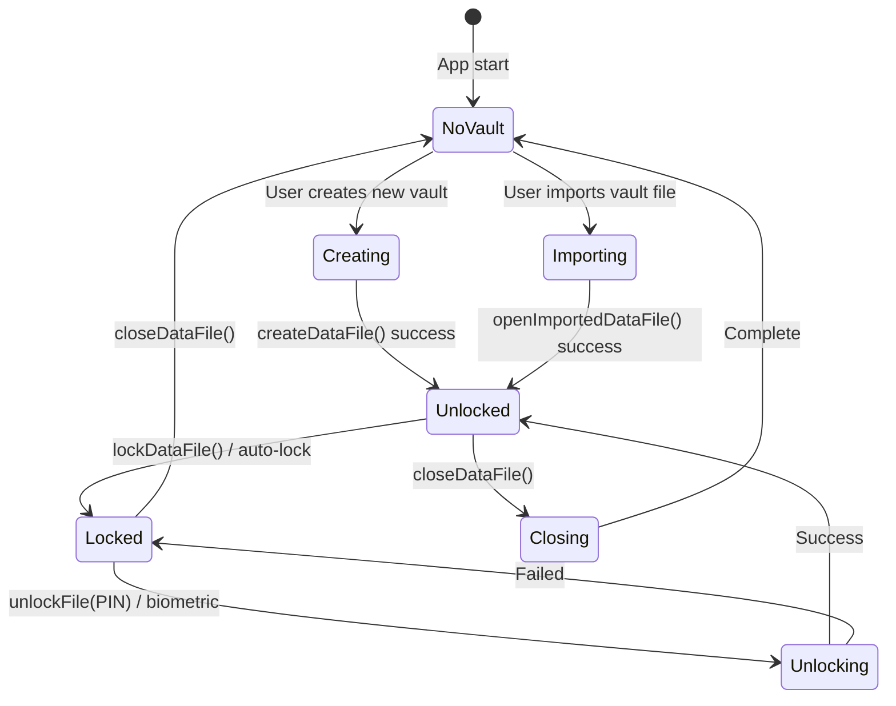
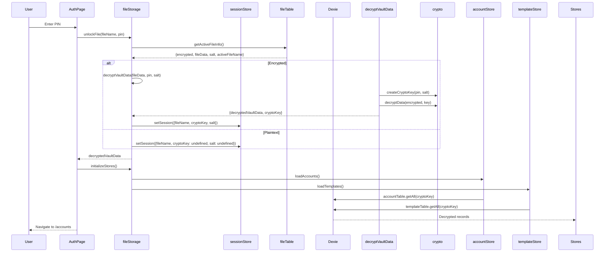
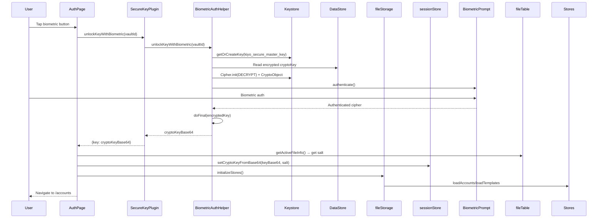
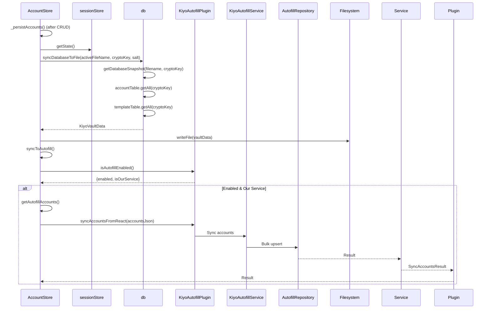
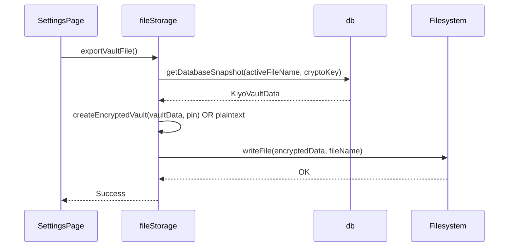
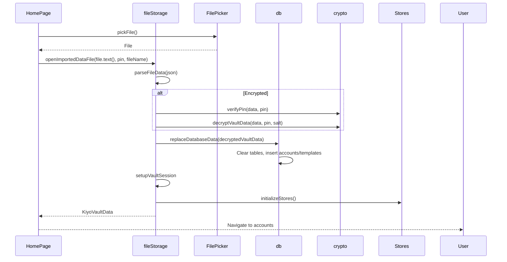

# Data Flow

> **Status**: Draft - needs full content from source evidence

## Vault Lifecycle



## File Storage Pipeline

```mermaid
flowchart TD
    subgraph "Create New Vault"
        A[createDataFile(fileName, pin?)] --> B{pin provided?}
        B -->|Yes| C[createCryptoKey(pin)]
        B -->|No| D[Plaintext vault]
        C --> E[encryptData(vault, key, salt)]
        E --> F[persistVaultRecord(fileName, encrypted)]
        D --> F
        F --> G[setupVaultSession(fileName, cryptoKey?, salt?)]
        G --> H[initializeStores()]
        H --> I[exportDataFile()]
    end
    
    subgraph "Open Existing Vault"
        J[unlockFile(fileName, pin)] --> K[fileTable.getActiveFileInfo()]
        K --> L{encrypted?}
        L -->|Yes| M[decryptVaultData(fileData, pin, salt)]
        L -->|No| N[Plaintext fileData]
        M --> O[setupVaultSession(fileName, cryptoKey, salt)]
        N --> O
        O --> H
    end
    
    subgraph "Import Vault File"
        O2[openImportedDataFile(json, pin, fileName)] --> P{encrypted?}
        P -->|Yes| Q[verifyPin(data, pin)]
        P -->|No| R[parseFileData]
        Q --> S[decryptVaultData]
        S --> T[replaceDatabaseData(decrypted)]
        R --> T
        T --> U[setupVaultSession]
        U --> H
    end
```

## File Storage Pipeline Functions (fileStorage.ts)

| Phase | Function | Input | Output | Purpose |
|-------|----------|-------|--------|---------|
| 1 | `createEncryptedVault(vaultData, pin)` | vaultData, pin | {encryptedVaultData, cryptoKey, salt} | PIN → CryptoKey → encrypt vault |
| 1.5 | `decryptVaultData(encryptedData, pin, salt)` | encrypted, pin, salt | {decryptedVaultData, cryptoKey} | PIN + salt → CryptoKey → decrypt vault |
| 2 | `persistVaultRecord(fileName, vaultData)` | fileName, vaultData | void | Save to IndexedDB files table |
| 3 | `setupVaultSession({fileName, cryptoKey, salt})` | session data | void | Store in sessionStore |
| 3.5 | `initializeStores()` | - | void | Load accounts/templates from Dexie |
| 4 | ~~syncAutofillToken()~~ | - | void | **DEPRECATED** - no-op |
| 5 | `exportDataFile(data, fileName)` | data, fileName | void | Write to Documents folder |

## Vault Unlock Flow (PIN)



## Vault Unlock Flow (Biometric)



## Autofill Sync Flow



## Account CRUD → Persistence Flow

```mermaid
flowchart TD
    A[User Action: Add/Edit/Delete Account] --> B[accountStore.addAccount/updateAccount/deleteAccount]
    B --> C[accountTable.create/update/delete with cryptoKey]
    C --> D[Dexie: accounts table]
    D --> E[_persistAccounts()]
    E --> F[syncDatabaseToFile]
    F --> G[getDatabaseSnapshot]
    G --> H[accountTable.getAll(cryptoKey)]
    H --> I[Filesystem.writeFile]
    E --> J[syncToAutofill]
    J --> K[KiyoAutofill.syncAccountsFromReact]
    K --> L[AutofillRepository.upsertAccount]
```

## Template CRUD → Persistence Flow

```mermaid
flowchart TD
    A[User Action: Create/Edit/Delete Template] --> B[templateStore.createTemplate/updateTemplate/deleteTemplate]
    B --> C[templateTable.create/update/delete with cryptoKey]
    C --> D[Dexie: templates table]
    D --> E[syncDatabaseToFile]
    E --> F[getDatabaseSnapshot]
    F --> G[templateTable.getAll(cryptoKey)]
    G --> H[Filesystem.writeFile]
```

## File Export/Import

### Export (User-initiated)


### Import (User-initiated)


## Data Consistency Invariants

| Invariant | Enforcement |
|-----------|-------------|
| Single active vault | `files` table uses fixed ID `"active"` |
| Vault file matches IndexedDB | `syncDatabaseToFile` writes snapshot after every CRUD |
| Autofill DB matches React vault | `syncToAutofill` called after every account CRUD |
| CryptoKey never persisted | Only in memory (React) or Keystore-wrapped (Android) |
| Salt per vault file | Stored in `files` table, used for PBKDF2 recreation |
| Auto-lock clears cryptoKey | `lockDataFile()` → sessionStore.clearCryptoKey() |

## Source Anchors

- Pipeline functions: `/src/database/fileStorage.ts` lines 44-140
- Vault create/unlock: `/src/database/fileStorage.ts` lines 280-380
- File export/import: `/src/database/fileStorage.ts` lines 144-240
- Session setup: `/src/database/fileStorage.ts` lines 113-128
- Account CRUD: `/src/store/accountStore.ts` lines 35-97
- Template CRUD: `/src/store/templateStore.ts` lines 39-95
- Sync to autofill: `/src/store/accountStore.ts` lines 99-137
- Autofill sync: `/android/app/src/main/java/com/kiyo/app/capacitor/KiyoAutofillPlugin.kt` lines 130-180
- File storage tests: `/src/database/fileStorage.lifecycle.integration.test.ts`