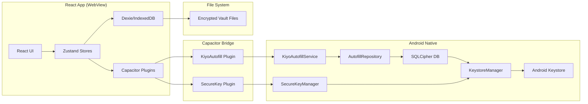

# Architecture Overview

> **Status**: Draft - needs full content from source evidence

## System Context

## Component Boundaries

| Layer | Technology | Responsibility |
|-------|------------|----------------|
| UI | React 19, Tailwind | Screens, forms, dialogs |
| State | Zustand | Session, accounts, templates, settings |
| Local DB | Dexie (IndexedDB) | Encrypted account/template records |
| Crypto | Web Crypto API | PBKDF2(100k) + AES-GCM vault encryption |
| Bridge | Capacitor 8 | Plugin communication to native |
| Autofill | Kotlin, AutofillService | System-level credential filling |
| Native DB | SQLCipher | Encrypted autofill account storage |
| Keystore | Android Keystore | Master key protection (TEE) |

## Data Flow Summary

1. **Vault Unlock**: PIN → PBKDF2 → CryptoKey → decrypt vault → load to IndexedDB → sync to autofill
2. **Account CRUD**: React store → Dexie (encrypted records) → file export → Capacitor sync → AutofillRepository
3. **Autofill Request**: Android system → KiyoAutofillService → ViewNode detection → DomainMatcher → FillResponse
4. **Biometric Unlock**: React → SecureKeyPlugin → BiometricPrompt + CryptoObject → Keystore → cryptoKey → vault decrypt

## Key Invariants

- **Encryption keys never touch disk** - only in memory (React cryptoKey, Android Keystore)
- **Vault files are self-contained** - encrypted JSON with salt/iv/ciphertext
- **Autofill DB key wrapped by Keystore** - DB_KEY encrypted with kiyo_master_key, stored in DataStore
- **Session survives app restart** - salt persisted in localStorage, cryptoKey reconstructed on unlock
- **Auto-lock clears cryptoKey** - immediate lock on timeout or background

## Extension Points

- **Custom field types** - FieldType enum in fieldTypes.ts, TemplateField in template.ts
- **Template system** - Builtin templates in builtinTemplates.ts, user templates in templateTable
- **Website presets** - websitePresets.ts for common login forms
- **Autofill field scoring** - FieldScorer.kt rules for username/password detection

## Source Anchors

- App entry: `/src/main.tsx`, `/src/App.tsx`
- Routing: `/src/App.tsx` lines 56-71
- Stores: `/src/store/*.ts`
- Crypto: `/src/crypto/encryption.ts`, `/src/crypto/recordEncryption.ts`
- Database: `/src/database/db.ts`, `/src/database/fileStorage.ts`
- Hooks: `/src/hooks/useAutoLock.ts`, `/src/hooks/useFileAuthGuard.ts`, `/src/hooks/useAndroidBackButton.ts`
- Pages: `/src/pages/*.tsx`
- Plugins: `/src/plugins/kiyautofill.ts`, `/src/plugins/kiyosecurekey.ts`
- Android service: `/android/app/src/main/java/com/kiyo/app/autofill/service/KiyoAutofillService.kt`
- Android security: `/android/app/src/main/java/com/kiyo/app/security/*.kt`