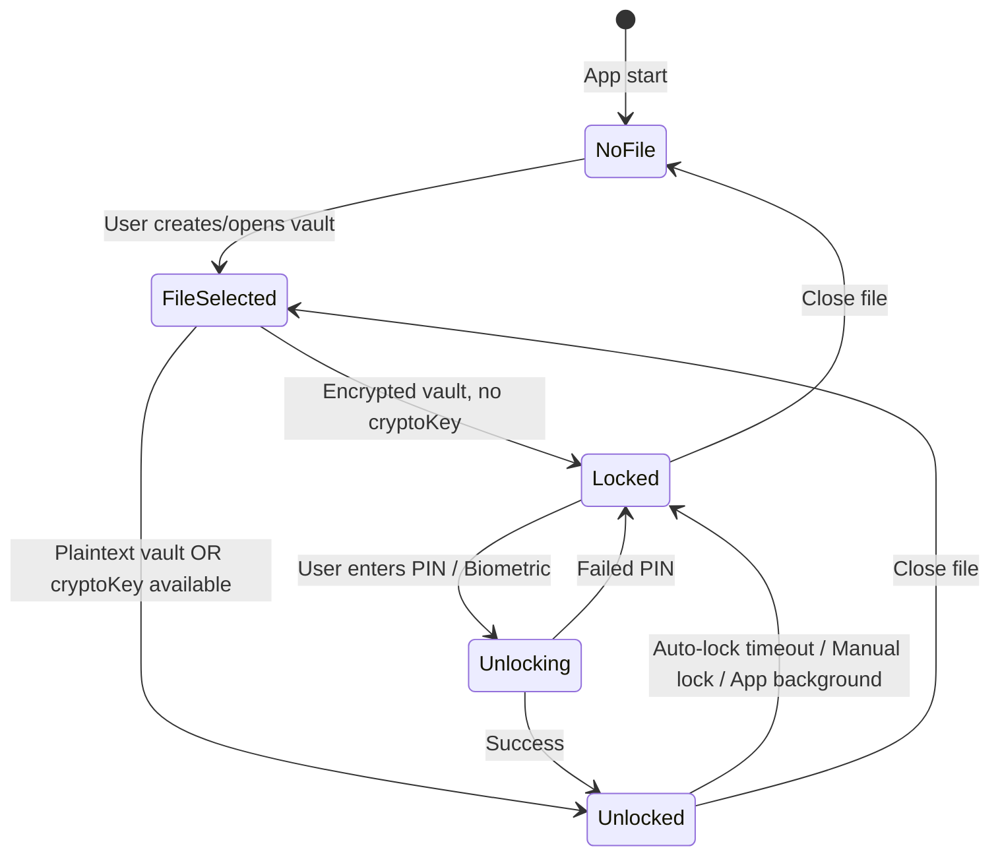
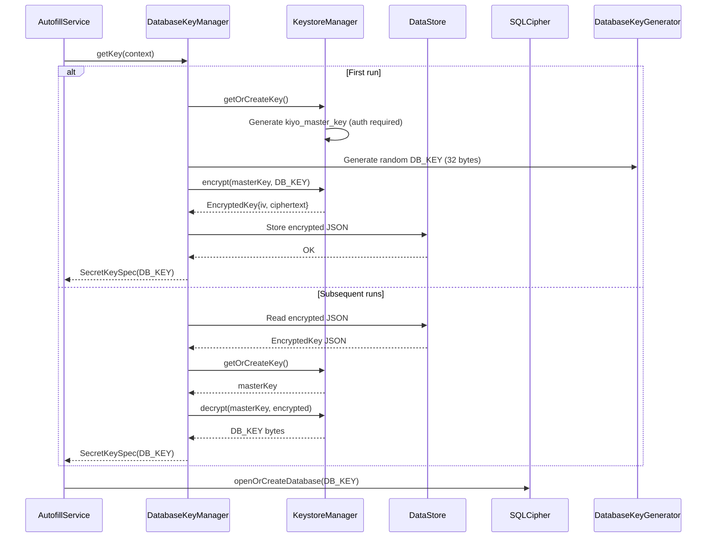
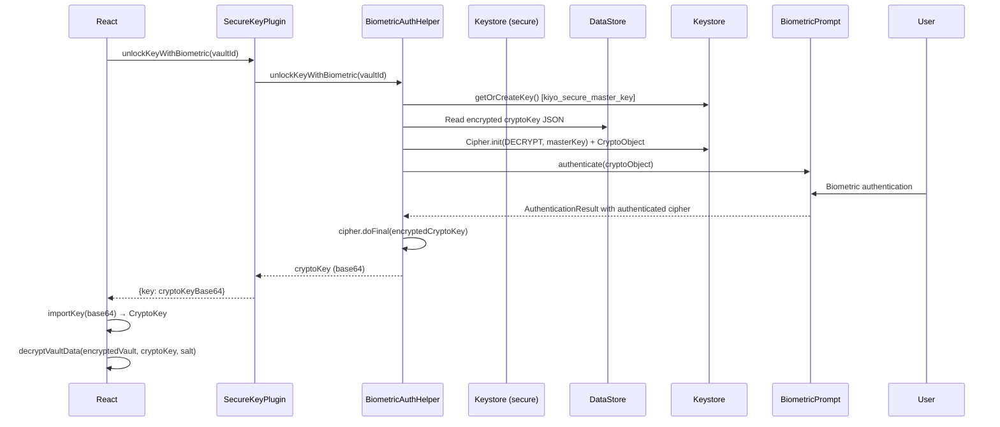

# Security Model

> **Status**: Draft - needs full content from source evidence

## Encryption Layers

<!-- openwiki: mermaid parse failed and this diagram was converted to a text fence so it does not break rendering. Fix the diagram source and restore the mermaid fence. Parser error: Heuristic: an unescaped angle bracket inside a label breaks rendering; rephrase the label. -->
```text
flowchart TD
    subgraph "User Input"
        PIN[User PIN]
    end
    
    subgraph "React Vault Encryption"
        PBKDF2[PBKDF2<br/>100,000 iterations<br/>SHA-256]
        AES1[AES-GCM<br/>256-bit key<br/>12-byte IV]
        Salt[16-byte Salt]
        VaultEnc[Encrypted Vault JSON<br/>salt + iv + ciphertext]
    end
    
    subgraph "IndexedDB Record Encryption"
        RecKey[Same CryptoKey]
        AES2[AES-GCM<br/>Per-record IV]
        RecEnc[Encrypted Records<br/>encryptedData + iv]
    end
    
    subgraph "Android Autofill DB"
        DBKey[Random 32-byte DB_KEY]
        SQLCipher[AES-256 SQLCipher]
        AutofillDB[(Encrypted SQLite)]
    end
    
    subgraph "Keystore Protection"
        MasterKey[kiyo_master_key<br/>AES-256-GCM<br/>User Auth Required]
        SecureKey[kiyo_secure_master_key<br/>AES-256-GCM<br/>Biometric Bound]
        DataStore[(DataStore<br/>Encrypted Keys)]
    end
    
    PIN --> PBKDF2
    PBKDF2 --> AES1
    Salt --> PBKDF2
    AES1 --> VaultEnc
    AES1 --> RecKey
    RecKey --> AES2
    AES2 --> RecEnc
    DBKey --> SQLCipher
    SQLCipher --> AutofillDB
    MasterKey -.->|wraps| DBKey
    SecureKey -.->|wraps| CryptoKey
    MasterKey --> DataStore
    SecureKey --> DataStore
```

## Key Hierarchy

```
┌─────────────────────────────────────────────────────────────┐
│                     USER PIN (memorized)                    │
└──────────────────────────┬──────────────────────────────────┘
                           │ PBKDF2(100k, SHA-256)
                           ▼
┌─────────────────────────────────────────────────────────────┐
│                  CRYPTO KEY (AES-256-GCM)                   │
│  • Vault encryption/decryption                              │
│  • Per-record IndexedDB encryption                          │
│  • In memory only, never persisted                          │
│  • Recreated on each unlock from PIN + stored salt          │
└──────────────────────────┬──────────────────────────────────┘
                           │
          ┌────────────────┴────────────────┐
          ▼                                 ▼
┌─────────────────────────┐     ┌─────────────────────────┐
│      VAULT FILE         │     │      INDEXED DB         │
│  (Documents folder)     │     │  (Dexie/IndexedDB)      │
│  EncryptedKiyoVaultData │     │  EncryptedRecord[]      │
│  {salt, iv, ciphertext} │     │  {encryptedData, iv}    │
└─────────────────────────┘     └─────────────────────────┘
```

## Android Keystore Keys

### `kiyo_master_key` (KeystoreManager)
- **Purpose**: Wraps SQLCipher DB_KEY for autofill database
- **Algorithm**: AES-256-GCM
- **Protection**: User authentication required (biometric OR device credential)
- **Auth validity**: 30 minutes
- **Invalidated by**: Biometric enrollment change
- **Usage**: AutofillRepository → DatabaseKeyManager → KeystoreManager

### `kiyo_secure_master_key` (SecureKeyManager)
- **Purpose**: Wraps React vault CryptoKey for biometric unlock
- **Algorithm**: AES-256-GCM
- **Protection**: Biometric STRONG only
- **Auth validity**: 30 minutes
- **Invalidated by**: Biometric enrollment change
- **Usage**: SecureKeyPlugin → BiometricAuthHelper → SecureKeyManager

## Session Management



### Session Store Persistence (localStorage)
- `activeFileName` - current vault file
- `salt` - vault salt (for PBKDF2 key recreation)
- `lastSyncTime` - autofill sync timestamp
- **NOT persisted**: `cryptoKey` (memory only)

### Auto-Lock Behavior
- Timeouts: `none` | `1m` | `10m` | `30m`
- Activity events: click, keydown, touchstart, scroll (passive listeners)
- On timeout: `lockDataFile()` → clears cryptoKey → redirects to `/auth`
- On cryptoKey loss: immediate lock

## Vault File Format

### Plaintext (`encrypted: false`)
```json
{
  "version": 1,
  "fileName": "kiyo-data.json",
  "updatedAt": 1234567890,
  "accounts": [...],
  "templates": [...],
  "metadata": [...]
}
```

### Encrypted (`encrypted: true`)
```json
{
  "version": 1,
  "encrypted": true,
  "salt": "base64(16 bytes)",
  "iv": "base64(12 bytes)",
  "ciphertext": "base64(AES-GCM ciphertext + 16-byte GCM tag)"
}
```

## IndexedDB Record Format

### Plaintext Record
```typescript
{
  version: 1,
  algorithm: "AES-GCM",
  encryptedData: Uint8Array,  // JSON string bytes
  iv: Uint8Array,             // 12 bytes (unused for plaintext)
  createdAt: number,
  updatedAt: number,
  encrypted: false
}
```

### Encrypted Record
```typescript
{
  version: 1,
  algorithm: "AES-GCM",
  encryptedData: Uint8Array,  // AES-GCM ciphertext + GCM tag
  iv: Uint8Array,             // 12 bytes
  createdAt: number,
  updatedAt: number,
  encrypted: true
}
```

## Autofill Database Key Lifecycle



## Biometric Vault Unlock Flow



## Threat Model & Mitigations

| Threat | Mitigation |
|--------|------------|
| Device theft | PIN required for vault, biometric for autofill, keys in Keystore (TEE) |
| Malicious app | No network permission, autofill only fills detected login forms |
| Backup extraction | Vault files encrypted with PBKDF2(100k), salt per file |
| Memory dump | cryptoKey only in JS memory, cleared on lock; Keystore keys non-extractable |
| Biometric spoof | AUTH_BIOMETRIC_STRONG, invalidated on enrollment change |
| SQLCipher key exposure | DB_KEY wrapped by Keystore master key, never in plaintext |

## Source Anchors

- Vault encryption: `/src/crypto/encryption.ts` (createCryptoKey, encryptData, decryptData)
- Record encryption: `/src/crypto/recordEncryption.ts` (encryptRecord, decryptRecord, createEncryptedRecord)
- Session store: `/src/store/sessionStore.ts` (persist config, setSession, clearCryptoKey)
- Auto-lock: `/src/hooks/useAutoLock.ts` (timer, activity detection, lockDataFile)
- File storage: `/src/database/fileStorage.ts` (pipeline functions, createEncryptedVault, decryptVaultData)
- KeystoreManager: `/android/app/src/main/java/com/kiyo/app/security/KeystoreManager.kt`
- SecureKeyManager: `/android/app/src/main/java/com/kiyo/app/securekey/SecureKeyManager.kt`
- DatabaseKeyManager: `/android/app/src/main/java/com/kiyo/app/security/DatabaseKeyManager.kt`
- BiometricAuthHelper: `/android/app/src/main/java/com/kiyo/app/securekey/BiometricAuthHelper.kt`
- EncryptedKey: `/android/app/src/main/java/com/kiyo/app/security/EncryptedKey.kt`