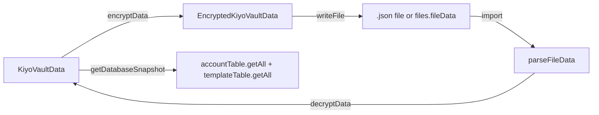

# KiyoVaultData

`/src/models/vault.ts` defines the top-level vault snapshot type and its encrypted counterpart.

## Plaintext Shape

```typescript
export interface KiyoVaultData {
  version: 1;
  fileName: string;
  updatedAt: number;
  accounts: Account[];
  templates: Template[];
  metadata: FileMetadata[];
}
```

`metadata` is a list of `FileMetadata` (singleton-like, normally one row). The settings table is intentionally excluded from the vault snapshot.

## Encrypted Shape

```typescript
export interface EncryptedKiyoVaultData {
  version: 1;
  encrypted: true;
  salt: string;       // base64 PBKDF2 salt (16 bytes)
  iv: string;         // base64 AES-GCM IV (12 bytes)
  ciphertext: string; // base64 ciphertext + GCM tag (16 bytes)
}
```

Used for `files.fileData` of encrypted vaults and for the user-exportable `.json` file blob.

## Type Guards

```typescript
export const isKiyoFile = (value: unknown): value is KiyoVaultData => {
  if (!value || typeof value !== "object") return false;
  const data = value as Record<string, unknown>;
  return (
    data.version === 1 &&
    typeof data.fileName === "string" &&
    typeof data.updatedAt === "number" &&
    Array.isArray(data.accounts) &&
    Array.isArray(data.templates) &&
    Array.isArray(data.metadata)
  );
};

export const isEncryptedKiyoVaultData = (
  value: unknown
): value is EncryptedKiyoVaultData => {
  if (!value || typeof value !== "object") return false;
  const data = value as Record<string, unknown>;
  return (
    data.version === 1 &&
    data.encrypted === true &&
    typeof data.salt === "string" &&
    typeof data.iv === "string" &&
    typeof data.ciphertext === "string"
  );
};
```

Used at the import boundary to distinguish plain vault JSON from encrypted blob.

## Flow



## Source Anchors

- `vault.ts` — `/src/models/vault.ts`
- Encryption — `/src/crypto/encryption.ts`
- Snapshot — `/src/database/db.ts::getDatabaseSnapshot`