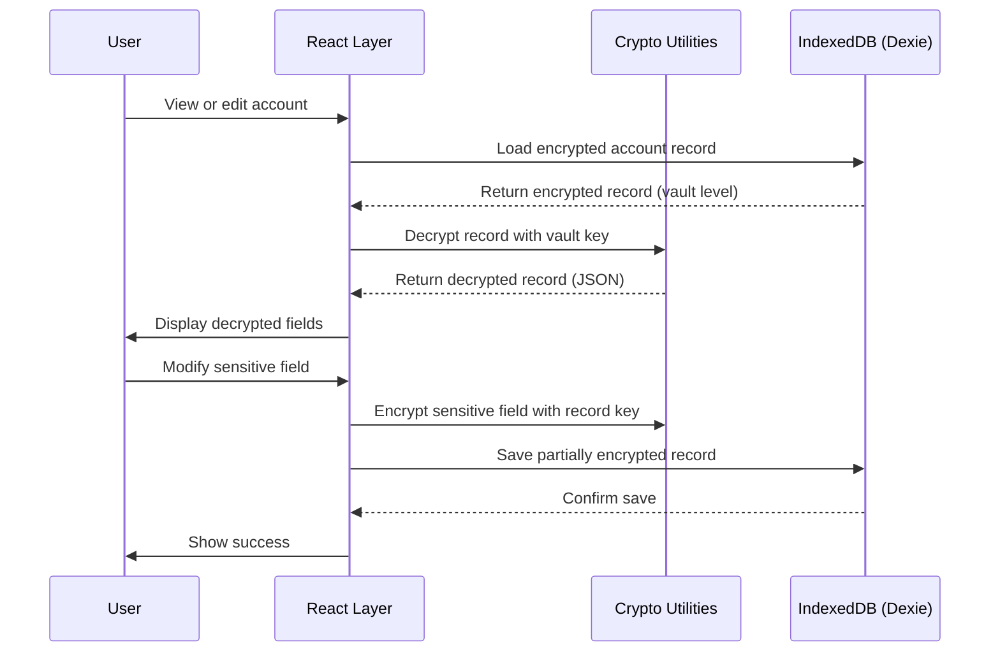

# Record Encryption

KIYO implements optional per-record encryption for highly sensitive fields (like passwords, 2FA secrets) within the already encrypted vault. This provides defense-in-depth: even if the vault key is compromised, individual fields remain protected by additional encryption keys derived per-account.

## Purpose

Record encryption protects the most sensitive data fields:
- Passwords
- 2FA secrets (TOTP)
- API keys/secrets
- Credit card numbers
- Other user-designated sensitive fields

This complements vault-level encryption by:
1. Limiting exposure if vault key is temporarily exposed
2. Allowing different sensitivity levels for different fields
3. Enabling secure sharing of non-sensitive data (e.g., usernames, websites) while keeping passwords private

## Encryption Flow



## Key Derivation

Each account gets a unique record encryption key derived from:
1. The vault encryption key (from PBKDF2 of user PIN)
2. A per-account salt stored with the account
3. A fixed context string to separate from vault key usage

```typescript
async function deriveRecordKey(vaultKey: CryptoKey, accountSalt: Uint8Array): Promise<CryptoKey> {
  // Import the vault key as raw material
  const keyMaterial = await subtle.exportKey("raw", vaultKey);
  
  // Combine with account salt and context
  const combined = new Uint8Array(
    keyMaterial.byteLength + accountSalt.byteLength + 
    new TextEncoder().encode("KIYO_RECORD_KEY").length
  );
  combined.set(keyMaterial, 0);
  combined.set(accountSalt, keyMaterial.byteLength);
  combined.set(
    new TextEncoder().encode("KIYO_RECORD_KEY"), 
    keyMaterial.byteLength + accountSalt.byteLength
  );
  
  // Derive record key using HKDF (or PBKDF2 with different params)
  return subtle.deriveKey(
    {
      name: "PBKDF2",
      salt: new Uint8Array(), // No additional salt - using vault key as base
      iterations: 100000,     // Same iterations as vault
      hash: "SHA-256"
    },
    await subtle.importKey(
      "raw",
      combined,
      { name: "PBKDF2" },
      false,
      ["deriveKey"]
    ),
    { name: "AES-GCM", length: 256 },
    false,
    ["encrypt", "decrypt"]
  );
}
```

## Encryption Process

When saving an account with record encryption enabled:
1. Identify fields marked for record encryption (based on field type or user preference)
2. For each sensitive field:
   - Generate random 12-byte nonce
   - Encrypt field value with AES-GCM using record key
   - Store: `nonce + ciphertext + tag` as Base64 string
3. Non-sensitive fields stored as plaintext
4. Account salt stored with account for key derivation

## Field Selection

Fields eligible for record encryption are determined by:
- **FieldType**: Certain types are always encrypted (`password`, `totp`, `apiKey`)
- **User Configuration**: Users can enable/disable per field type in settings
- **Template Definition**: Templates can specify default encryption for fields

### Always Encrypted Types
- `password`: User passwords
- `totp`: 2FA secret keys
- `apiKey` / `apiSecret`: API credentials
- `creditCard`: Credit card numbers
- `bankAccount`: Bank account numbers

### Configurable Types
- `text`: Can be encrypted if contains sensitive info
- `textarea`: Notes/memos that might contain sensitive data

## Data Structure

Encrypted fields are stored as objects to distinguish from plaintext:

```typescript
// Encrypted field storage format
interface EncryptedFieldValue {
  __encrypted__: true;
  nonce: string;    // Base64 encoded 12-byte nonce
  ciphertext: string; // Base64 encoded ciphertext+tag
}

// Usage in Account model
interface Account {
  id: string;
  website: string;           // Plaintext (non-sensitive)
  username: string;          // May be plaintext or encrypted
  password: EncryptedFieldValue; // Always encrypted
  totp: EncryptedFieldValue | null; // Optional 2FA
  notes: string;             // Plaintext by default
  // ... other fields
}
```

## Implementation Details

### Crypto Utilities
- **File**: `/src/crypto/recordEncryption.ts`
- **Functions**:
  - `encryptRecordField(value: string, recordKey: CryptoKey): Promise<EncryptedFieldValue>`
  - `decryptRecordField(encrypted: EncryptedFieldValue, recordKey: CryptoKey): Promise<string>`
  - `generateAccountSalt(): Uint8Array` - creates unique salt per account

### Integration Points
1. **Account Model**: `/src/models/account.ts` - defines which fields use encryption
2. **Table Modules**: `/src/database/table-modules/accountTable.ts` - encrypt/decrypt during DB operations
3. **Account Store**: `/src/store/accountStore.ts` - transparent encryption for UI
4. **Settings**: Users can configure encryption preferences

## Security Properties

- **Per-Account Keys**: Each account has unique encryption key
- **Forward Security**: Compromising one account key doesn't reveal others
- **Vault Key Separation**: Record keys derived from but cryptographically isolated from vault key
- **Authentication**: AES-GCM provides integrity protection for each field
- **Nonce Uniqueness**: Random nonces prevent reuse attacks

## Performance Considerations

- **Selective Encryption**: Only encrypt fields that need it
- **Key Caching**: Record keys cached briefly during account operations
- **Lazy Decryption**: Fields decrypted only when accessed/displayed
- **Batch Operations**: Efficient encryption/decryption for bulk operations

## Source

- Files: `/src/crypto/recordEncryption.ts`
- Model Definitions: `/src/models/account.ts`, `/src/models/fieldTypes.ts`
- Database Integration: `/src/database/table-modules/accountTable.ts`
- Usage: `/src/store/accountStore.ts` (getters/setters)
- Testing: `/src/crypto/recordEncryption.integration.test.ts`