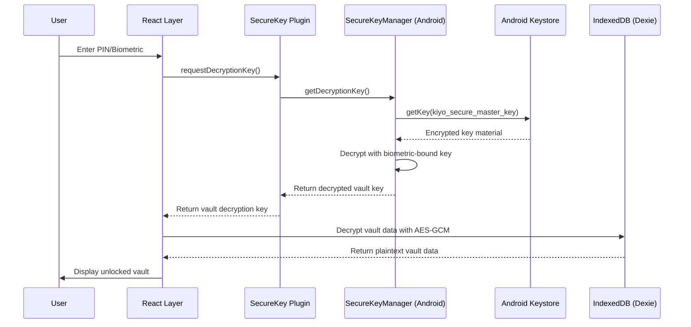

# Vault Encryption

KIYO uses PBKDF2 for key derivation and AES-GCM for authenticated encryption to protect vault data stored in IndexedDB. This ensures that even if someone gains access to the device's storage, they cannot decrypt the vault without the user's PIN or biometric authentication.

## Purpose

The vault encryption layer protects:
- Account credentials (usernames, passwords, 2FA secrets)
- Template definitions
- File metadata
- Application settings
- All user data stored in IndexedDB

## Encryption Flow



## Key Derivation (PBKDF2)

When a vault is created or the user changes their PIN:
1. User provides a PIN (minimum 4 digits)
2. System generates a random 16-byte salt
3. PBKDF2-SHA256 derives a key from PIN + salt:
   - Iterations: 100,000 (as specified in README)
   - Key length: 32 bytes (256 bits) for AES-256
4. The derived key is encrypted using the biometric-bound key from Android Keystore
5. Encrypted key + salt are stored in IndexedDB

```typescript
// Simplified PBKDF2 derivation
import { subtle } from "@peculiar/webcrypto";

async function deriveKeyFromPin(pin: string, salt: Uint8Array): Promise<CryptoKey> {
  const encoder = new TextEncoder();
  const pinBytes = encoder.encode(pin);
  
  const keyMaterial = await subtle.importKey(
    "raw",
    pinBytes,
    { name: "PBKDF2" },
    false,
    ["deriveKey"]
  );
  
  return subtle.deriveKey(
    {
      name: "PBKDF2",
      salt: salt,
      iterations: 100000,
      hash: "SHA-256"
    },
    keyMaterial,
    { name: "AES-GCM", length: 256 },
    false,
    ["encrypt", "decrypt"]
  );
}
```

## Data Encryption (AES-GCM)

For encrypting vault data:
1. Generate a random 12-byte nonce (IV) for AES-GCM
2. Encrypt the plaintext JSON data using AES-GCM with the vault key
3. AES-GCM produces ciphertext + 16-byte authentication tag
4. Store: `nonce + ciphertext + tag` as the encrypted blob

```typescript
async function encryptVaultData(plaintext: string, key: CryptoKey): Promise<ArrayBuffer> {
  const encoder = new TextEncoder();
  const data = encoder.encode(plaintext);
  
  // Generate random IV
  const iv = crypto.getRandomValues(new Uint8Array(12));
  
  const ciphertext = await subtle.encrypt(
    {
      name: "AES-GCM",
      iv: iv
    },
    key,
    data
  );
  
  // Combine IV + ciphertext (tag is included in ciphertext for AES-GCM)
  const result = new Uint8Array(iv.length + ciphertext.byteLength);
  result.set(iv);
  result.set(new Uint8Array(ciphertext), iv.length);
  
  return result.buffer;
}

async function decryptVaultData(encrypted: ArrayBuffer, key: CryptoKey): Promise<string> {
  const bytes = new Uint8Array(encrypted);
  const iv = bytes.slice(0, 12);
  const ciphertext = bytes.slice(12);
  
  const plaintext = await subtle.decrypt(
    {
      name: "AES-GCM",
      iv: iv
    },
    key,
    ciphertext
  );
  
  return new TextDecoder().decode(plaintext);
}
```

## Key Management

The vault encryption key never persists in plaintext:
- **In Memory**: Only held briefly during encryption/decryption operations
- **In Storage**: Always encrypted with a key from Android Keystore
- **In Transit**: Protected by Capacitor plugin interface (encrypted blobs)

### Key Hierarchy
1. **User PIN** → PBKDF2 → **Vault Encryption Key** (AES-256-GCM)
2. **Vault Encryption Key** → Encrypted by → **kiyo_secure_master_key** (Android Keystore)
3. **kiyo_secure_master_key** → Protected by → **Android Keystore** (TEE/StrongBox)
4. **Biometric Auth** → Authorizes use of → **kiyo_secure_master_key**

## Record-Level Encryption

In addition to vault-level encryption, individual sensitive fields (like passwords) can be encrypted separately in IndexedDB for additional protection. See [Record Encryption](/openwiki/frontend/crypto/record-encryption.md).

## Security Properties

- **Confidentiality**: AES-256-GCM provides strong encryption
- **Integrity**: GCM mode provides authentication to detect tampering
- **Key Salt**: Unique salt per vault prevents rainbow table attacks
- **Work Factor**: 100,000 PBKDF2 iterations slows brute-force attacks
- **Key Isolation**: Vault key never exposed to React layer in plaintext
- **Biometric Binding**: Decryption requires biometric authorization via Android Keystore

## Vulnerability Mitigations

- **Side-channel Attacks**: Constant-time crypto operations where possible
- **Memory Scraping**: Keys zeroed after use; limited time in memory
- **Replay Attacks**: GCM authentication tags prevent ciphertext modification
- **Weak PINs**: Rate limiting via Auto-lock and biometric fallback

## Source

- Files: `/src/crypto/encryption.ts`, `/src/crypto/keyManagement.ts`
- Usage: `/src/database/fileStorage.ts` (vault CRUD operations)
- Android Integration: `/openwiki/android/security/secure-key-manager.md`
- Testing: `/src/crypto/**/*.test.ts`
- Web Crypto API: `@peculiar/webcrypto` for consistent cross-browser crypto