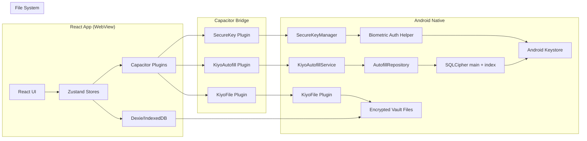

# KIYO Wiki Quickstart

KIYO is an **offline-first, privacy-focused Android password manager** with system-level autofill integration. The repository pairs a React 19 / TypeScript frontend running inside a Capacitor 8 WebView with Kotlin native code that implements the Android `AutofillService` (API 26+), SQLCipher-backed credential storage, and Android Keystore-mediated key wrapping.

This wiki documents the source so an agent or contributor can understand the system, navigate the code, and safely change it.

## Architecture at a Glance

## Navigation Map

| Intent / Change Area | Wiki Page(s) | Key Entrypoints / Symbols | Focused Tests | Validation Command |
|----------------------|---------------|----------------------------|---------------|---------------------|
| Overall system architecture | [architecture/overview.md](architecture/overview.md), [architecture/data-flow.md](architecture/data-flow.md) | `src/main.tsx`, `src/App.tsx`, `android/app/src/main/java/com/kiyo/app/KiyoApplication.kt` | n/a | `npm run build` |
| Encryption / key management | [architecture/security-model.md](architecture/security-model.md), [frontend/crypto/](frontend/crypto/), [android/security/](android/security/) | `src/crypto/encryption.ts`, `src/crypto/recordEncryption.ts`, `android/app/src/main/java/com/kiyo/app/security/DatabaseKeyManager.kt` | `src/crypto/encryption.test.ts`, `src/database/fileStorage.encryption.integration.test.ts`, `android/app/src/test/java/com/kiyo/app/security/DatabaseKeyManagerTest.kt` | `npm run test -- --reporter verbose crypto` |
| Vault lifecycle (create/open/import/change-pin/lock/close) | [frontend/database/file-storage.md](frontend/database/file-storage.md), [frontend/database/dexie-schema.md](frontend/database/dexie-schema.md) | `src/database/fileStorage.ts` (`createDataFile`, `unlockFile`, `closeDataFile`, `changePin`) | `src/database/fileStorage.lifecycle.integration.test.ts`, `src/database/fileStorage.encryption.integration.test.ts` | `npm run test` |
| Multi-vault model and v14 PK migration | [frontend/database/file-storage.md](frontend/database/file-storage.md), [frontend/database/dexie-schema.md](frontend/database/dexie-schema.md) | `src/database/fileTable.ts::resolveFileName`, `src/database/db.ts::KiyoDatabase.version(14)` | `src/database/fileStorage.encryption.integration.test.ts` | `npm run test` |
| Auto-save / Sync Queue | [frontend/database/sync-queue.md](frontend/database/sync-queue.md) | `src/database/syncQueue.ts`, `src/database/db.ts::persistVaultSnapshot` | `src/database/fileStorage.lifecycle.integration.test.ts` | `npm run test` |
| Zustand stores | [frontend/state-management.md](frontend/state-management.md) | `src/store/{sessionStore,accountStore,templateStore,settingsStore}.ts` | `src/store/settingsStore.test.ts`, `src/database/accountTable.integration.test.ts` | `npm run test` |
| Routing / preload state machine | [frontend/app-structure.md](frontend/app-structure.md), [frontend/pages/root-redirect.md](frontend/pages/root-redirect.md) | `src/App.tsx`, `src/pages/RootRedirect.tsx` | `src/pages/RootRedirect.test.tsx`, `src/App.simple.test.tsx` | `npm run test` |
| UI pages | [frontend/pages/](frontend/pages/) | `src/pages/**/*.{ts,tsx}` | `src/pages/**/*.test.{ts,tsx}` | `npm run test` |
| Shared components & dialogs | [frontend/components/overview.md](frontend/components/overview.md), [frontend/components/dialogs/](frontend/components/dialogs/) | `src/components/**/*.{ts,tsx}` | `src/components/**/*.test.{ts,tsx}` | `npm run test` |
| Capacitor plugins (web) | [frontend/capacitor-plugins/](frontend/capacitor-plugins/) | `src/plugins/{kiyautofill,kiyosecurekey,kiyofile}.ts` (+ `.web.ts` fallbacks) | web tests via `common.setup.ts` mocks | `npm run test` |
| Hooks (auto-lock, file guard, back button) | [frontend/hooks/](frontend/hooks/) | `src/hooks/{useAutoLock,useFileAuthGuard,useAndroidBackButton,useClipboard}.ts(x)` | `src/hooks/useAutoLock.test.tsx`, `src/hooks/useFileAuthGuard.test.tsx` | `npm run test` |
| Android autofill service | [android/autofill-service/](android/autofill-service/) | `android/app/src/main/java/com/kiyo/app/autofill/service/KiyoAutofillService.kt`, `autofill/detection/`, `autofill/viewnode/`, `autofill/response/` | `android/app/src/test/java/com/kiyo/app/autofill/{FieldScorer,FieldScoringRules,DomainMatcher,HtmlAttributeExtractor}Test.kt` | `./gradlew testDebugUnitTest` |
| Android autofill repository | [android/repository/](android/repository/) | `AutofillRepository.kt`, `AutofillDatabaseHelper.kt`, `AutofillIndexDatabaseHelper.kt` | `android/app/src/test/java/com/kiyo/app/autofill/repository/{AccountMapper,DomainMatcher}Test.kt` | `./gradlew testDebugUnitTest` |
| Android Keystore / DB_KEY | [android/security/](android/security/) | `KeystoreManager.kt`, `DatabaseKeyManager.kt`, `EncryptedKey.kt`, `DatabaseKeyGenerator.kt` | `android/app/src/test/java/com/kiyo/app/security/{KeystoreManager,DatabaseKeyManager}Test.kt` | `./gradlew testDebugUnitTest` |
| Android SQLCipher migrations | [android/repository/database-migrations.md](android/repository/database-migrations.md) | `AutofillDatabaseHelper.kt::onCreate/onUpgrade`, `AutofillIndexDatabaseHelper.kt` | Robolectric `AutofillDatabaseHelperTest` (where present) | `./gradlew testDebugUnitTest` |
| Capacitor plugins (native) | [android/capacitor-plugins/](android/capacitor-plugins/) | `KiyoAutofillPlugin.kt`, `SecureKeyPlugin.kt`, `KiyoFilePlugin.kt`, `AutofillSyncManager.kt`, `AutofillPlatformBridge.kt` | `android/app/src/test/java/com/kiyo/app/capacitor/{AutofillSyncManager,KiyoAutofillPlugin}Test.kt` | `./gradlew testDebugUnitTest` |
| Biometric vault unlock | [android/securekey/](android/securekey/) | `SecureKeyManager.kt`, `BiometricAuthHelper.kt`, `BiometricAuthHelperFactory` | n/a (manual / androidTest only) | `./gradlew connectedAndroidTest` |
| Android E2E (autofill, autosave, biometric) | [testing/android-e2e-tests.md](testing/android-e2e-tests.md), [android/test-host.md](android/test-host.md) | `android/run-{autofill,autosave,biometric}-e2e.ps1`, page objects under `android/app/src/androidTest/.../e2e/pageobjects/` | `android/app/src/androidTest/java/com/kiyo/app/{autofill/AutofillE2E,autosave/AutosaveE2E,biometric/BiometricUnlockE2E}Test.kt` | `npm run test:e2e:android`, `npm run test:e2e:biometric` |
| Data models | [models/](models/), [data-models/](data-models/), [frontend/data/](frontend/data/) | `src/models/*.ts`, `src/data/*.ts` | `src/database/{account,template,file}Table.integration.test.ts` | `npm run test` |
| Build / CI / Release | [operations/](operations/) | `vite.config.ts`, `capacitor.config.ts`, `.github/workflows/*.yml` | n/a | `npm run android:build`, `npm run check` |

## Key Concepts

### Vault
A vault is an encrypted JSON file (`KiyoVaultData` plaintext or `EncryptedKiyoVaultData` after `createEncryptedVault`). Each vault is a row in the `files` Dexie table keyed by `fileName` (since v14). The PIN derives a `CryptoKey` via PBKDF2 (100k iterations, SHA-256) which encrypts the vault blob with AES-GCM.

### Multi-vault Model
Since v14, the `files` table uses `fileName` as PK instead of the legacy `"active"` literal. Multiple vault files co-exist; `resolveFileName` appends `(N)` for collisions. `closeDataFile` clears the active session and in-memory stores but preserves the `files` rows. Switching vaults calls `initializeStores()` which resets the store-side `initialized` guard so `loadAccounts`/`loadTemplates` reload from the freshly-decrypted vault.

### Two-Stage Autofill (Matching Layer)
The Android `KiyoAutofillService.onFillRequest` is intentionally two-stage:
1. Open `kiyo_autofill_index.db` (non-auth `INDEX_KEY`) and run `findMatchingAccountIdsByIndex(domain, packageNames)`.
2. **Only if** Stage 1 returns matches, acquire `kiyo_master_key_N` (auth-required `DB_KEY`) and open `kiyo_autofill.db` to fetch full credentials.

This design ensures that autofill requests for sites/apps that have no matching credentials never trigger an Android Keystore auth prompt. The index DB is rebuilt on every full React→Native sync (`syncAndRebuildIndex`).

### Auto-Lock
`useAutoLock` enforces a `none | 1m | 10m | 30m` timeout. Activity events (click, keydown, touchstart, scroll) reset the timer. On expiry, `lockDataFile` clears `cryptoKey` (vault and DB rows remain). The `cryptoKey` is in memory only — never persisted.

### Keystore Master Keys
Two separate Keystore keys:
- `kiyo_master_key_N` (alias pointer + indexed migration) — wraps `DB_KEY` for the autofill SQLCipher DB. Auth-required (biometric or device credential).
- `kiyo_secure_master_key` — wraps the React `cryptoKey` for biometric vault unlock. Biometric STRONG only.

`kiyo_index_master_key` / `kiyo_index_key` are non-auth Keystore keys that encrypt the index DB only.

### Capacitor Bridge
The WebView ↔ native communication happens via three Capacitor plugins: `KiyoAutofill` (status + sync), `SecureKey` (biometric vault unlock), `KiyoFile` (SAF backup). Web fallbacks (`*.web.ts`) return safe defaults so the React app runs in a browser without changes.

## Common Tasks

### Adding a New Account Field Type
1. Add to `FieldType` union in `src/models/fieldTypes.ts`.
2. Add to `DEFAULT_TEMPLATE_FIELDS` and `BUILTIN_TEMPLATES` (`src/data/builtinTemplates.ts`) if applicable.
3. Map to the right input component in `src/components/inputs/Input.tsx` and `PasswordField.tsx`.
4. Add focused tests in `src/database/templateTable.integration.test.ts`.

### Modifying Autofill Behavior
1. Identify the relevant Kotlin module under `android/app/src/main/java/com/kiyo/app/autofill/`.
2. For detection changes: edit `detection/FieldScorer.kt` or `FieldScoringRules.kt` constants.
3. For matching changes: edit `repository/DomainMatcher.kt`.
4. Add Robolectric test under `android/app/src/test/java/com/kiyo/app/autofill/...`.
5. Run `npm run test:e2e:android` for the E2E suite (emulator required).

### Changing Encryption Parameters
1. `src/crypto/encryption.ts` — `createCryptoKey`, `encryptData`, `decryptData`.
2. `src/crypto/recordEncryption.ts` — per-record AES-GCM encryption.
3. `android/app/src/main/java/com/kiyo/app/security/DatabaseKeyManager.kt` — `rewrapDbKey`, alias pointer, reset flow.
4. Re-run `npm run check` and `npm run test -- --reporter verbose crypto`.

### Adding a New Settings Option
1. Add to `src/store/settingsStore.ts` (state field + partialize + setter).
2. Update `src/pages/Settings/components/{SecuritySection,UISection,DataSection,AutofillSection}.tsx`.
3. If persisted to Android native (e.g., `autoBackupEnabled`/`autoBackupUri`), add to `src/database/db.ts::tryTriggerAutoBackup` consumer.
4. Add focused tests in `src/store/settingsStore.test.ts`.

## Source of Truth

- **Source code + tests** are authoritative. Every wiki page links back to source anchors.
- **README.md** and **STRATEGY.md** at the repository root are upstream product documentation.
- **/openwiki/** is the generated evidence index. The scheduled OpenWiki GitHub Actions workflow refreshes it. Treat the wiki as just-in-time context, not startup reading.

## Getting Help

- Search the codebase with targeted tools (rg, grep) — the wiki is a map, not a copy.
- Look at tests for the behavior expected by the developer (tests are the contract).
- For Android Keystore errors, check logcat with the relevant tags (`KeystoreManager`, `DatabaseKeyManager`, `BiometricAuthHelper`).
- For React-side issues, use the Vitest UI (`npm run test:ui`) and dev-tools.